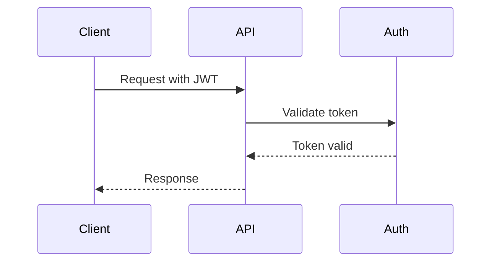

Creating documentation is easier with AI assistance. The `/create-doc` command guides you through creating new pages by analyzing your codebase and asking the right questions.

## How It Works

The create process:

1. **Understands your intent** - Asks what you want to document (feature, code, API, etc.)
2. **Gathers information** - Collects details about the topic, audience, and structure
3. **Analyzes codebase** - Extracts relevant code, examples, and context
4. **Selects template** - Chooses the right structure (guide, tutorial, API reference, etc.)
5. **Generates content** - Creates MDX with real examples from your code
6. **Updates navigation** - Adds the page to docs.json

## Running Create

<Tabs>
  <Tab title="Claude Code">
    ```
    /create-doc
    ```
  </Tab>
  <Tab title="Cursor">
    In Agent mode:
    
    "Create a new documentation page for the authentication feature"
    
    Or be specific:
    
    "Create a tutorial for setting up webhooks"
  </Tab>
</Tabs>

## What Can You Create?

When you run `/create-doc`, you'll be asked what to document:

| Option | Template Used | Best For |
|--------|---------------|----------|
| **Feature or concept** | Guide | Explaining how something works |
| **Code files** | API Reference | Documenting functions, classes, types |
| **API endpoints** | API Reference | REST or GraphQL documentation |
| **Tutorials** | Tutorial | Step-by-step walkthroughs |
| **Quickstart** | Quickstart | Getting started guides |
| **Troubleshooting** | Troubleshooting | FAQs and common issues |

## Example: Document a Feature

```
You: /create-doc

AI: What would you like to document?
    1. A feature or concept
    2. Code files
    3. API endpoints
    4. Something else

You: 1

AI: What's the topic? 

You: User authentication with JWT

AI: What type of page should this be?
    1. Guide - Explain how it works
    2. Tutorial - Step-by-step walkthrough
    3. Reference - API/function documentation

You: 1

AI: Analyzing authentication code...

    Found:
    ✓ src/auth/jwt.ts - JWT utilities
    ✓ src/middleware/auth.ts - Auth middleware
    ✓ src/types/user.ts - User types

    Creating guide with:
    - Overview of JWT authentication
    - Configuration options
    - Code examples from your codebase
    - Mermaid diagram for auth flow

    Save to: docs/guides/authentication.mdx?

You: yes

AI: Created docs/guides/authentication.mdx
    Add to navigation? (docs.json)

You: yes

AI: Done! Use /commit-doc when ready to commit.
```

## Example: Document Code

```
You: /create-doc

AI: What would you like to document?

You: 2 (Code files)

AI: Which files or directories?

You: src/utils/

AI: What should I focus on?
    1. Public API only
    2. Architecture overview
    3. Usage examples
    4. Everything

You: 1

AI: Analyzing src/utils/...

    Found 12 exported functions:
    - formatDate(date, format)
    - parseJSON(text)
    - debounce(fn, ms)
    ... (9 more)

    I'll create API reference pages with:
    - Function signatures
    - Parameter tables
    - Return types
    - Usage examples from tests

    Proceed?
```

## Templates

The AI uses templates from `.devdoc/templates/` to ensure consistent structure:

| Template | Structure |
|----------|-----------|
| `guide.md` | Overview → Key Concepts → How It Works → Examples → Best Practices |
| `tutorial.md` | Prerequisites → Steps → Verification → Next Steps |
| `api-reference.md` | Description → Parameters → Response → Examples → Errors |
| `quickstart.md` | Install → Configure → First Use → What's Next |
| `troubleshooting.md` | Symptom → Cause → Solution |

## Mermaid Diagrams

The AI automatically adds diagrams where helpful:

- **Flowcharts** for processes and decisions
- **Sequence diagrams** for API flows
- **State diagrams** for lifecycles
- **Entity diagrams** for data models

Example generated diagram:



## Best Practices

<AccordionGroup>
  <Accordion title="Be specific about the topic">
    Instead of "create docs for auth", say "create a guide for JWT authentication with refresh tokens"
  </Accordion>
  
  <Accordion title="Point to specific files">
    When documenting code, specify the files: "document the functions in src/utils/validation.ts"
  </Accordion>
  
  <Accordion title="Choose the right template">
    Guides explain concepts, tutorials walk through steps, references document APIs
  </Accordion>
  
  <Accordion title="Review generated content">
    The AI extracts real code but may miss context. Review and add domain knowledge.
  </Accordion>
  
  <Accordion title="Commit incrementally">
    Use `/commit-doc` after creating each page to keep commits focused.
  </Accordion>
</AccordionGroup>

## After Creating

Once your page is created:

1. **Preview** - Run `npx @brainfish-ai/devdoc dev` to see it
2. **Review** - Check for TODOs and fill in missing details
3. **Commit** - Use `/commit-doc` to save your changes

## Next Steps

<CardGroup cols={2}>
  <Card title="Update Documentation" icon="arrows-clockwise" href="/ai-agents/update-docs">
    Keep docs in sync with code
  </Card>
  <Card title="MDX Components" icon="puzzle-piece" href="/essentials/markdown">
    Learn about available components
  </Card>
  <Card title="Navigation" icon="list" href="/config/docs-json">
    Configure docs.json
  </Card>
  <Card title="Bootstrap Docs" icon="rocket-launch" href="/ai-agents/bootstrap">
    Generate initial documentation
  </Card>
</CardGroup>
