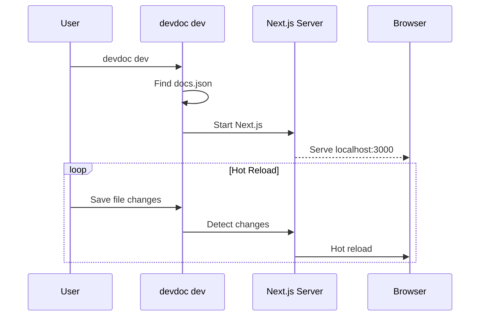

Start a local development server to preview your documentation with hot reload.

## Usage

```bash
npx @brainfish-ai/devdoc dev [options]
```

## Options

| Option | Description | Default |
|--------|-------------|---------|
| `-p, --port <number>` | Port to run on | 3333 |
| `-H, --host <host>` | Host to bind to | localhost |
| `-o, --open` | Open browser automatically | true |
| `--no-open` | Disable automatic browser opening | - |

## Basic Usage

Start the development server:

```bash
npx @brainfish-ai/devdoc dev
```

Output:

```
○ Starting DevDoc development server...
✓ Loaded configuration: My Documentation

○ Content directory: /Users/you/my-docs
○ Starting server at http://localhost:3333
○ Press Ctrl+C to stop

○ Opening http://localhost:3333 in your browser...
```

The browser will automatically open to your documentation site.

## Disable Auto-Open

If you don't want the browser to open automatically:

```bash
npx @brainfish-ai/devdoc dev --no-open
```

## Custom Port

Run on a different port:

```bash
npx @brainfish-ai/devdoc dev --port 4000
```

## Hot Reload

The development server automatically reloads when you:

- Edit MDX/MD files
- Modify `docs.json`
- Update `theme.json`

No need to restart the server!

## First Run

On first run, DevDoc installs renderer dependencies. You'll see a progress bar:

```
○ Installing renderer dependencies (first run)...

  [████████████████░░░░░░░░░░░░░░] 53% 245/462 packages

✓ Dependencies installed
```

This only happens once. Subsequent runs start immediately.

## Features

### Live Preview

See your changes instantly as you type. The browser automatically refreshes when files change.

### Error Overlay

Syntax errors in MDX are displayed in the browser with helpful messages:

```
Error in quickstart.mdx

  SyntaxError: Unexpected token at line 15

  14 | <Note>
  15 | This is missing a closing tag
     |     ^
```

### Fast Refresh

React components preserve their state during hot reload, making development faster.

## How It Works



## Environment Variables

| Variable | Description |
|----------|-------------|
| `PORT` | Alternative way to set port |
| `DEVDOC_PROJECT_ROOT` | Override project root directory |

## Troubleshooting

### Port Already in Use

If port 3000 is busy:

```bash
npx @brainfish-ai/devdoc dev --port 3001
```

Or find and kill the process:

```bash
lsof -i :3000
kill -9 <PID>
```

### Changes Not Reflecting

Try clearing the Next.js cache:

```bash
rm -rf .next
npx @brainfish-ai/devdoc dev
```

### MDX Parsing Errors

Check your MDX syntax. Common issues:

- Unclosed JSX tags
- Invalid frontmatter YAML
- Mismatched component brackets

Run the check command for detailed validation:

```bash
npx @brainfish-ai/devdoc check
```
