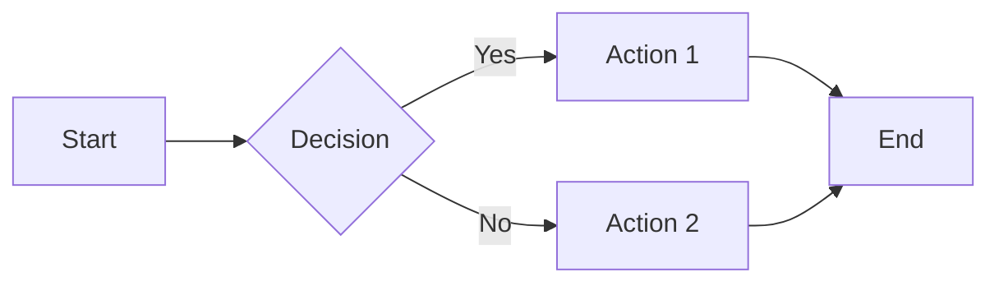
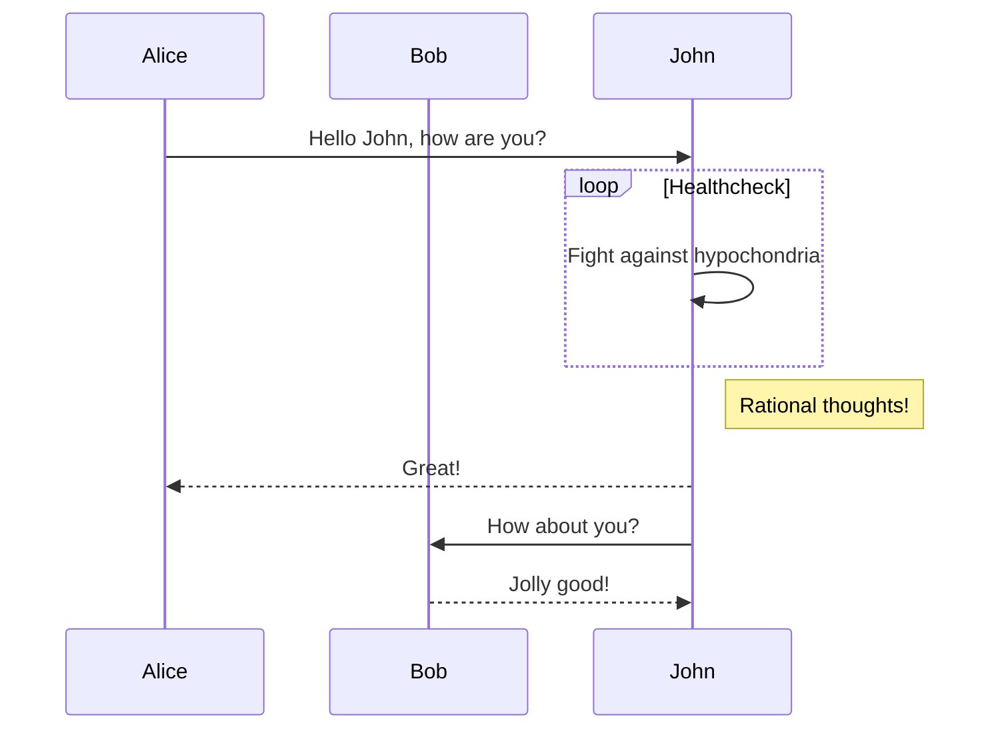
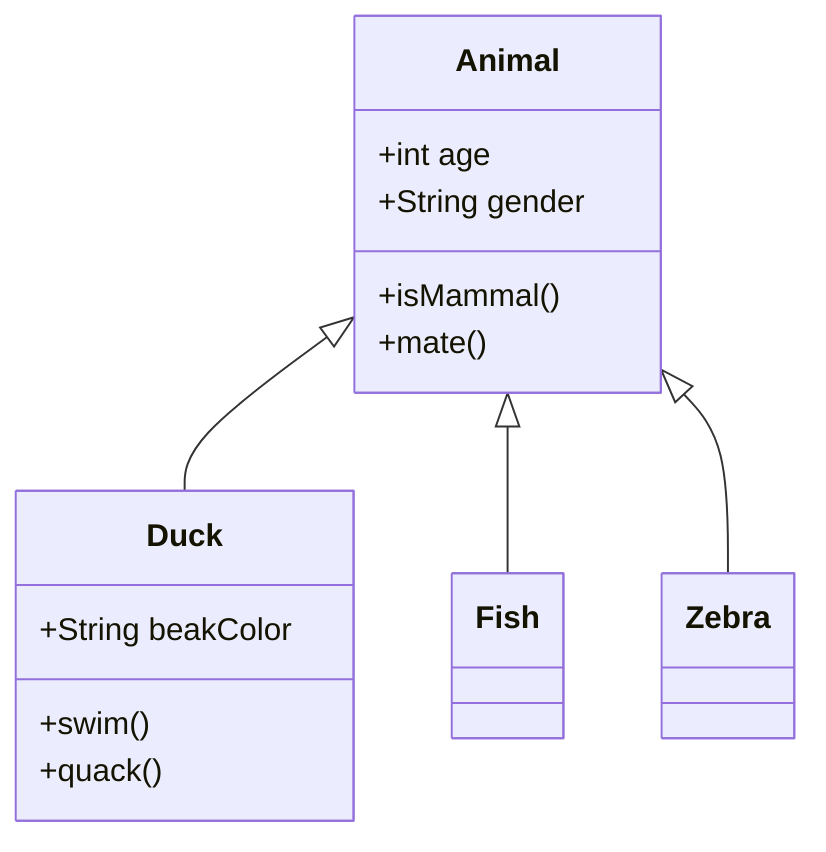
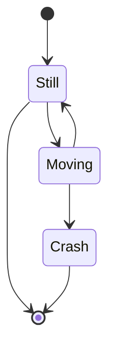
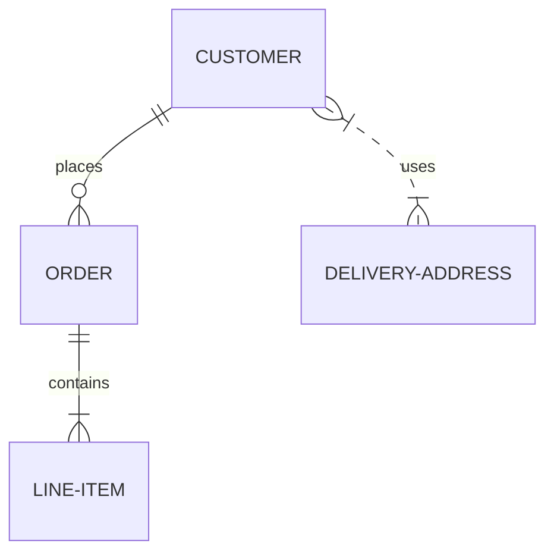
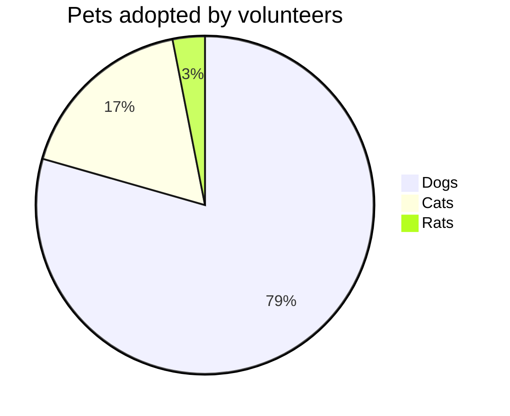
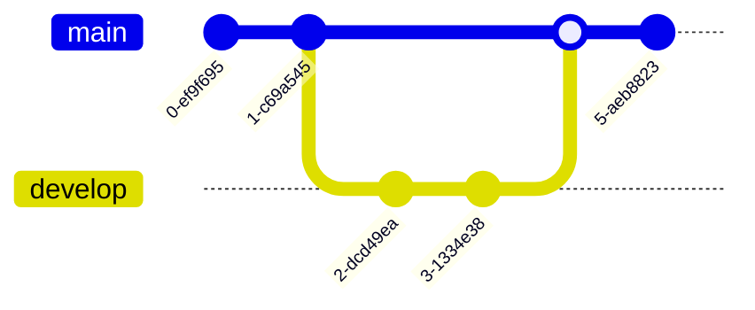
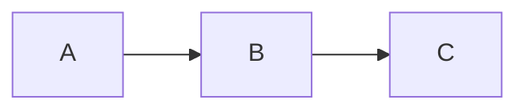

Mermaid lets you build flowcharts, sequence diagrams, Gantt charts, and other diagrams using text and code.

For a complete list of supported diagram types and syntax, see the [Mermaid documentation](https://mermaid.js.org/intro/).

## Flowchart Example

<Mermaid>
{`flowchart LR
    A[Start] --> B{Decision}
    B -->|Yes| C[Action 1]
    B -->|No| D[Action 2]
    C --> E[End]
    D --> E`}
</Mermaid>

~~~markdown

~~~

## Sequence Diagram

<Mermaid>
{`sequenceDiagram
    participant Alice
    participant Bob
    Alice->>John: Hello John, how are you?
    loop Healthcheck
        John->>John: Fight against hypochondria
    end
    Note right of John: Rational thoughts!
    John-->>Alice: Great!
    John->>Bob: How about you?
    Bob-->>John: Jolly good!`}
</Mermaid>

~~~markdown

~~~

## Class Diagram

<Mermaid>
{`classDiagram
    Animal <|-- Duck
    Animal <|-- Fish
    Animal <|-- Zebra
    Animal : +int age
    Animal : +String gender
    Animal: +isMammal()
    Animal: +mate()
    class Duck{
      +String beakColor
      +swim()
      +quack()
    }
    class Fish{
      -int sizeInFeet
      -canEat()
    }
    class Zebra{
      +bool is_wild
      +run()
    }`}
</Mermaid>

~~~markdown

~~~

## State Diagram

<Mermaid>
{`stateDiagram-v2
    [*] --> Still
    Still --> [*]
    Still --> Moving
    Moving --> Still
    Moving --> Crash
    Crash --> [*]`}
</Mermaid>

~~~markdown

~~~

## Entity Relationship Diagram

<Mermaid>
{`erDiagram
    CUSTOMER ||--o{ ORDER : places
    ORDER ||--|{ LINE-ITEM : contains
    CUSTOMER }|..|{ DELIVERY-ADDRESS : uses`}
</Mermaid>

~~~markdown

~~~

## Pie Chart

<Mermaid>
{`pie title Pets adopted by volunteers
    "Dogs" : 386
    "Cats" : 85
    "Rats" : 15`}
</Mermaid>

~~~markdown

~~~

## Git Graph

<Mermaid>
{`gitGraph
    commit
    commit
    branch develop
    checkout develop
    commit
    commit
    checkout main
    merge develop
    commit
    commit`}
</Mermaid>

~~~markdown

~~~

## Interactive Controls

All Mermaid diagrams include interactive zoom and pan controls that appear in the bottom-right corner of the diagram.

- **Zoom in/out**: Use the zoom buttons to increase or decrease the diagram scale.
- **Pan**: Use the directional arrows to move around the diagram.
- **Reset view**: Click the reset button to return to the original view.

The controls are especially useful for large or complex diagrams that don't fit entirely in the viewport.

## Syntax

There are two ways to create Mermaid diagrams:

### Code Fence Syntax (Recommended)

Use standard markdown code fences with the `mermaid` language identifier:

~~~markdown

~~~

This is the simplest and most portable syntax that works across many documentation platforms.

### Component Syntax

Alternatively, use the `Mermaid` component directly:

```jsx
<Mermaid>
{`flowchart LR
    A --> B --> C
`}
</Mermaid>
```

<Note>
  When using the component syntax, the diagram code should be wrapped in template literals (backticks) inside curly braces for proper parsing.
</Note>

## Supported Diagram Types

Mermaid supports a wide variety of diagram types:

<table>
  <thead>
    <tr>
      <th>Type</th>
      <th>Description</th>
    </tr>
  </thead>
  <tbody>
    <tr>
      <td>Flowchart</td>
      <td>Flow and process diagrams</td>
    </tr>
    <tr>
      <td>Sequence</td>
      <td>Interaction diagrams</td>
    </tr>
    <tr>
      <td>Class</td>
      <td>Object-oriented class structures</td>
    </tr>
    <tr>
      <td>State</td>
      <td>State machine diagrams</td>
    </tr>
    <tr>
      <td>ER</td>
      <td>Entity relationship diagrams</td>
    </tr>
    <tr>
      <td>Gantt</td>
      <td>Project timelines</td>
    </tr>
    <tr>
      <td>Pie</td>
      <td>Pie charts</td>
    </tr>
    <tr>
      <td>Git Graph</td>
      <td>Git branch visualizations</td>
    </tr>
    <tr>
      <td>Mindmap</td>
      <td>Mind maps</td>
    </tr>
    <tr>
      <td>Timeline</td>
      <td>Timeline visualizations</td>
    </tr>
  </tbody>
</table>
