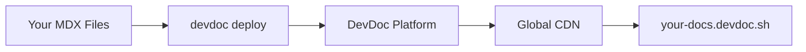

DevDoc provides managed hosting for your documentation. Deploy with a single command and get a live URL instantly.

## Quick Deploy

```bash
npx @brainfish-ai/devdoc deploy
```

Your docs will be live at `https://your-project-xxxxx.devdoc.sh`.

## How It Works



1. **Bundle** - CLI bundles your MDX files and configuration
2. **Upload** - Content is uploaded to DevDoc's storage
3. **Deploy** - Instantly available on our global CDN
4. **Live** - Your docs are live at your subdomain

## Deployment Outputs

After deployment, you'll receive:

| Output | Description |
|--------|-------------|
| URL | Your live documentation URL |
| Project Slug | Unique identifier for your project |
| API Key | Secret key for future deployments |

## Subdomain

By default, your docs are hosted at:

```
https://<your-subdomain>.devdoc.sh
```

Example: `https://my-api-docs.devdoc.sh`

<Note>
  **Subdomains are only reserved when you deploy.** Running `devdoc init` or `devdoc create` checks availability but doesn't claim the subdomain. This prevents subdomain squatting.
</Note>

### Subdomain Already Taken

If your chosen subdomain was taken between initialization and deployment, you'll be prompted to choose a new one:

```bash
⚠ Subdomain "my-docs" is no longer available.

○ Suggestion: my-docs-a1b2.devdoc.sh

Enter a new subdomain (my-docs-a1b2): _
```

## Custom Domains

Each project gets **one free custom domain**. Connect your own domain like `docs.example.com`:

```bash
# Add custom domain
npx @brainfish-ai/devdoc domain add docs.example.com

# Configure DNS records (shown in CLI output)
# Then verify
npx @brainfish-ai/devdoc domain verify

# Check status
npx @brainfish-ai/devdoc domain status
```

Your documentation will be accessible at both:
- `https://your-project.devdoc.sh` (default)
- `https://docs.example.com` (custom domain)

<Card title="Custom Domains Guide" icon="globe" href="/custom-domains">
  Complete guide to setting up custom domains, DNS configuration, and troubleshooting.
</Card>

## Deployment Options

### Production Deploy

Default deployment to your live URL:

```bash
npx @brainfish-ai/devdoc deploy
```

### Dry Run

Validate without deploying:

```bash
npx @brainfish-ai/devdoc deploy --dry-run
```

## CI/CD Integration

Automate deployments with your CI/CD pipeline. See the [CI/CD Guide](/ci-cd) for detailed setup.

Quick example with GitHub Actions:

```yaml
- name: Deploy Docs
  env:
    DEVDOC_API_KEY: ${{ secrets.DEVDOC_API_KEY }}
  run: npx @brainfish-ai/devdoc deploy
```

## Rollbacks

<Note>
  Rollback functionality is coming soon. For now, redeploy a previous version of your content.
</Note>

## Deployment Limits

| Limit | Free | Pro |
|-------|------|-----|
| Deploys per day | 50 | Unlimited |
| File size | 5 MB | 25 MB |
| Total content | 50 MB | 500 MB |

## What Gets Deployed

The following files are included in each deployment:

- ✅ MDX/MD files referenced in `docs.json`
- ✅ `docs.json` configuration
- ✅ `theme.json` (if present)
- ✅ OpenAPI spec files (if configured)
- ❌ `node_modules/`
- ❌ `.git/`
- ❌ `.devdoc.json` (secrets)

## Troubleshooting

### Deployment Failed

1. Run validation first:
   ```bash
   npx @brainfish-ai/devdoc check
   ```

2. Check for common issues:
   - Invalid `docs.json` syntax
   - Missing referenced MDX files
   - File too large

### Content Not Updating

Clear your browser cache or try incognito mode. CDN cache expires after 60 seconds.

### Wrong Content Showing

Ensure you're looking at the correct URL. Each deploy creates the same URL unless you've regenerated the project.
