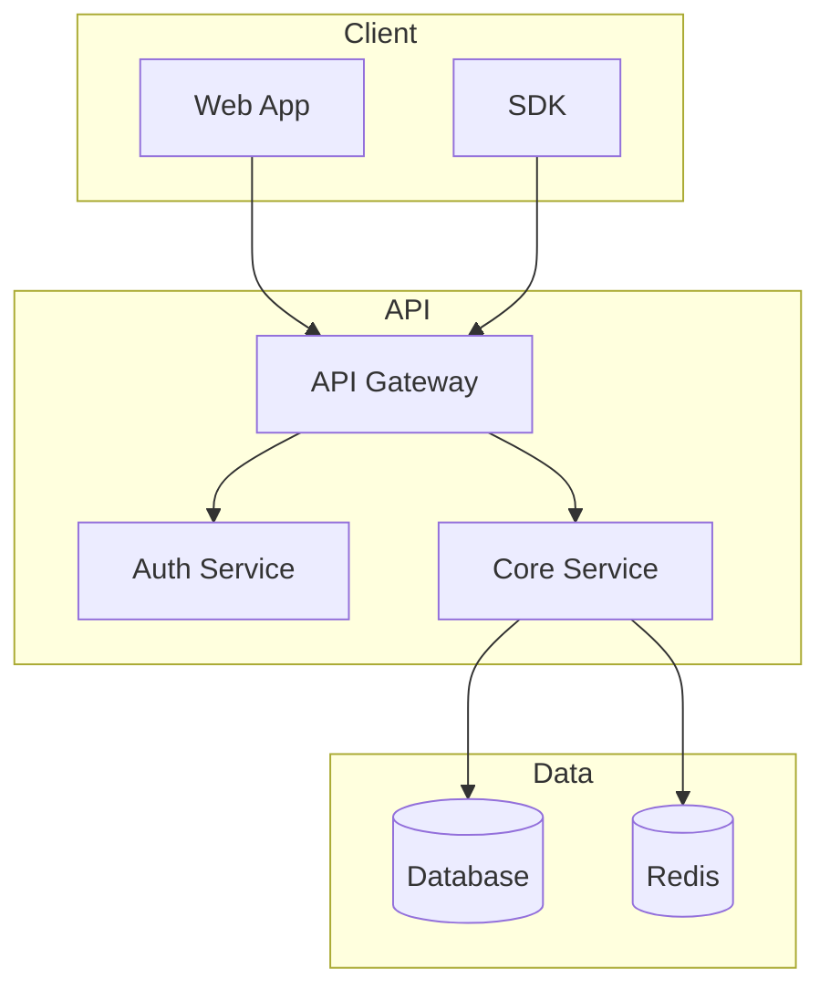
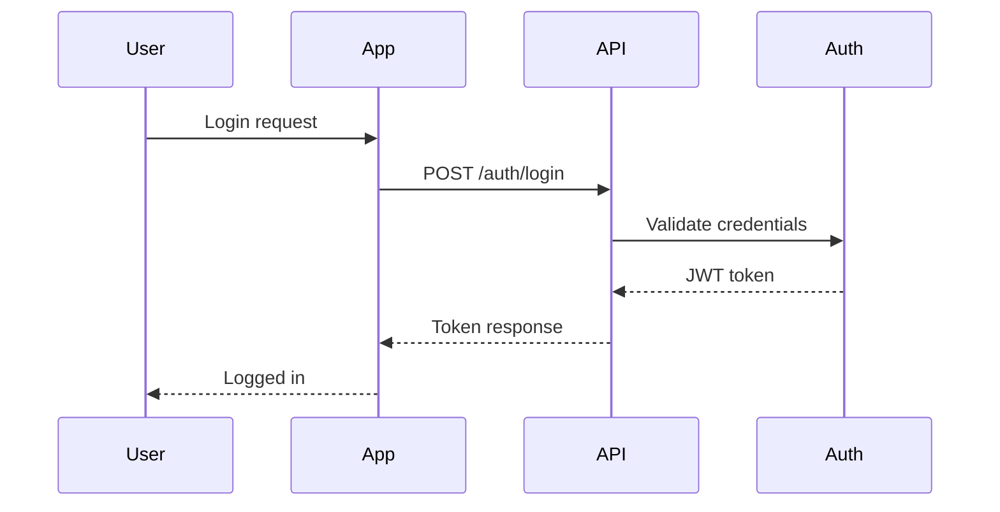
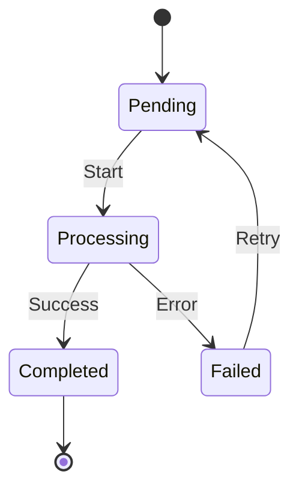
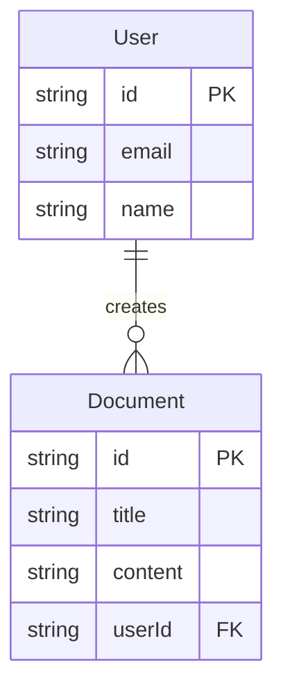

## Instructions

When bootstrapping documentation from a repository, follow the **Documentation Planning Pyramid** approach used by documentation experts:

```
┌─────────────────────────────────────────────────────────────────────┐
│                    DOCUMENTATION PLANNING PYRAMID                    │
├─────────────────────────────────────────────────────────────────────┤
│                         ┌─────────────┐                              │
│                         │  STRATEGY   │  ← WHY (Step 1-2)            │
│                         │  Overview & │                              │
│                         │  Audience   │                              │
│                         └──────┬──────┘                              │
│                                │                                     │
│                    ┌───────────┴───────────┐                         │
│                    │  INFORMATION          │  ← WHAT (Step 3-4)      │
│                    │  ARCHITECTURE         │                         │
│                    └───────────┬───────────┘                         │
│                                │                                     │
│                       ┌────────┴────────┐                            │
│                       │    APPROVAL     │  ← CONFIRM (Step 5)        │
│                       │  User confirms  │                            │
│                       │   IA structure  │                            │
│                       └────────┬────────┘                            │
│                                │                                     │
│             ┌──────────────────┴──────────────────┐                  │
│             │              CONTENT                │  ← HOW (Step 6-8) │
│             │      Pages using Diátaxis Types     │                  │
│             └─────────────────────────────────────┘                  │
└─────────────────────────────────────────────────────────────────────┘
```

---

## Phase 1: Strategy (WHY)

### Step 1: Project Overview (Quick Scan)

**Get a quick understanding of the project using git:**

```bash
# List all tracked files
git ls-files

# Get folder structure (top-level)
git ls-files | cut -d'/' -f1 | sort -u

# Check for key files
git ls-files | grep -E "(README|package\.json|openapi|swagger|schema\.graphql)"
```

**Generate a brief project summary (<100 words):**

```
📁 PROJECT OVERVIEW

Name: [from package.json or README]
Type: [API/Library/CLI/Web App]
Language: [TypeScript/Python/Go/etc.]
Framework: [Next.js/Express/FastAPI/etc.]

Structure:
├── src/           → Source code
├── lib/           → Library code
├── api/           → API routes
├── docs/          → Documentation (if exists)
└── tests/         → Test files

Key Files:
• README.md        → Project description
• package.json     → Dependencies
• openapi.json     → API spec (if exists)

Summary: [One sentence describing what this project does]
```

**If NO codebase found:**
- Tell user: "No codebase detected. Creating docs-only project."
- Skip to Step 2

**If `.devdoc/context.json` exists:** Read and use existing preferences.

### Step 2: Define Documentation Goals & Audience

**Ask the user strategic questions before any scanning:**

#### Question 1: Documentation Purpose (WHY)
```
What is the primary goal of this documentation?

1. **Enable team productivity** - Help internal developers work faster
2. **Onboard new developers** - Get new team members up to speed  
3. **Support API consumers** - Help external devs integrate your API
4. **Guide product users** - Help end users accomplish tasks
5. **Inform stakeholders** - Communicate architecture and decisions
```

#### Question 2: Audiences & Roles (WHO)
```
Who are your documentation audiences?

═══════════════════════════════════════════════════════════
           SINGLE vs MULTI-ROLE PRODUCTS
═══════════════════════════════════════════════════════════

Does your product have multiple user roles with different permissions?

A) **Single audience** - All users have same access
   → Example: Open-source library, public API

B) **Multiple roles** - Different users see different features
   → Example: SaaS with Admin/User roles, Enterprise with permissions
```

**If Single Audience (A), choose one:**
```
1. **Internal Developer** - Engineers on your team
   → Needs: Code flow, architecture, debugging, contribution guides
   
2. **External Developer** - API consumers, SDK users
   → Needs: Quick start, authentication, code examples, reference
   
3. **Product User** - End users of your product
   → Needs: Tutorials, feature guides, troubleshooting
   
4. **Content Author** - Technical writers, doc contributors
   → Needs: MDX syntax, structure guidelines, publishing workflow
   
5. **Product Manager/Stakeholder** - Non-technical team members
   → Needs: Feature overview, roadmap, IA map
```

**If Multiple Roles (B), define your role matrix:**
```
═══════════════════════════════════════════════════════════
                 ROLE MATRIX DEFINITION
═══════════════════════════════════════════════════════════

List your user roles and their permissions:

Example for a SaaS product:
┌─────────────────┬────────────────────────────────────────┐
│ Role            │ Permissions / Features                 │
├─────────────────┼────────────────────────────────────────┤
│ Admin           │ All features, user management, billing │
│ Editor          │ Create/edit content, limited settings  │
│ Viewer          │ Read-only access                       │
│ API Developer   │ API access, webhooks, integrations     │
└─────────────────┴────────────────────────────────────────┘

Your roles:
1. Role name: _______ 
   - Permissions: _______
   - Key features: _______

2. Role name: _______
   - Permissions: _______
   - Key features: _______

(Add more as needed)
```

**For Multi-Role Products, also ask:**
```
How should role-specific content be organized?

1. **Separate sections** - Each role gets its own section/tab
   docs/
   ├── admin/           # Admin-only guides
   ├── users/           # Regular user guides
   └── developers/      # API/developer guides

2. **Inline badges** - Mixed content with role indicators
   <RoleBadge roles={["admin", "editor"]}>
   This feature is only available to Admins and Editors.
   </RoleBadge>

3. **Permission gates** - Content varies by logged-in user
   (Requires auth integration)

4. **Hybrid** - Combination of above
```

#### Question 3: Documentation Domain
```
What type of documentation are you creating?

1. **API Docs** - REST/GraphQL API reference for developers
   → Voice: Professional, code-focused
   
2. **Product Docs** - Feature guides and tutorials for end users
   → Voice: Friendly, approachable
   
3. **Internal Docs** - Team setup, architecture, contribution guides
   → Voice: Technical, direct
```

#### Question 4: API Type (if API Docs selected)
```
What type of API do you have?

1. **OpenAPI/REST** - I have an OpenAPI/Swagger spec
2. **GraphQL** - I have a GraphQL schema
3. **Both** - REST and GraphQL APIs
4. **Manual** - I'll document the API manually (no spec file)
```

#### Question 5: Code Examples Language
```
What language should code examples use?
(e.g., TypeScript, Python, curl, Go)
```

---

## Phase 2: Information Architecture (WHAT)

### Step 3: Locate & Import API Specs (if applicable)

**Only if user selected OpenAPI or GraphQL:**

For OpenAPI:
```
Do you have an OpenAPI spec file? Please provide the path, or I can search for:
- openapi.json / openapi.yaml
- swagger.json / swagger.yaml
```

For GraphQL:
```
Do you have a GraphQL schema? Please provide the path, or I can search for:
- schema.graphql / schema.gql
```

**After locating spec:**
1. Copy to `api-reference/` folder
2. Validate the spec
3. Extract metadata (endpoints, types, auth)

### Step 4: Plan Content Using Diátaxis Framework

**Classify each planned page by content type:**

| Type | Purpose | When to Use | Example Pages |
|------|---------|-------------|---------------|
| **Tutorial** | Learning-oriented | First-time experience, guided learning | "Build Your First..." |
| **How-To Guide** | Task-oriented | Accomplish specific goals | "Add Custom Domain", "Configure Theme" |
| **Reference** | Information-oriented | Look up facts, specifications | Component props, CLI flags, Config schema |
| **Explanation** | Understanding-oriented | Deeper comprehension | "How MDX Processing Works", Architecture |

**Map documentation structure based on domain:**

#### For API Docs:
```
docs/
├── index.mdx              # [Explanation] Overview, value prop
├── quickstart.mdx         # [Tutorial] 5-min getting started
├── authentication.mdx     # [How-To] Auth setup
├── guides/
│   ├── overview.mdx       # [Explanation] Core concepts
│   └── {use-cases}.mdx    # [How-To] Common use cases
├── api-reference/
│   ├── openapi.json       # Imported spec
│   ├── introduction.mdx   # [Explanation] API overview
│   └── errors.mdx         # [Reference] Error codes
└── sdks/                  # [Reference] SDK docs
```

#### For Product Docs:
```
docs/
├── index.mdx              # [Explanation] Product overview
├── getting-started/
│   ├── quickstart.mdx     # [Tutorial] First experience
│   └── key-concepts.mdx   # [Explanation] Core concepts
├── features/
│   └── {feature}.mdx      # [How-To] Feature guides
├── tutorials/
│   └── {tutorial}.mdx     # [Tutorial] Step-by-step learning
└── troubleshooting/       # [How-To] Problem solving
```

#### For Multi-Role Products (with separate sections):
```
docs/
├── index.mdx              # [Explanation] Product overview (all roles)
├── getting-started/
│   ├── quickstart.mdx     # [Tutorial] First experience (all roles)
│   └── key-concepts.mdx   # [Explanation] Core concepts (all roles)
│
├── admin/                 # 🔒 ADMIN-ONLY SECTION
│   ├── overview.mdx       # [Explanation] Admin dashboard overview
│   ├── user-management.mdx # [How-To] Manage users & permissions
│   ├── billing.mdx        # [How-To] Billing & subscriptions
│   ├── settings.mdx       # [Reference] Admin settings
│   └── audit-logs.mdx     # [Reference] Audit & compliance
│
├── users/                 # 👤 REGULAR USER SECTION
│   ├── overview.mdx       # [Explanation] User dashboard
│   ├── features/          # [How-To] Feature guides
│   └── account.mdx        # [How-To] Account settings
│
├── developers/            # 💻 DEVELOPER SECTION
│   ├── overview.mdx       # [Explanation] API overview
│   ├── authentication.mdx # [How-To] API auth
│   ├── webhooks.mdx       # [How-To] Webhook setup
│   └── api-reference/     # [Reference] API docs
│
└── troubleshooting/       # [How-To] Problem solving (all roles)
```

#### For Multi-Role Products (with inline badges):
```
When using inline role badges, add to each page's frontmatter:

---
title: User Management
description: Add and manage users in your organization
roles: ["admin", "owner"]  # Roles that can access this feature
---

<RoleBadge roles={["admin", "owner"]}>
  This feature requires Admin or Owner permissions.
</RoleBadge>

## Overview

User management allows you to...
```

#### Role-Specific Content Patterns:

**Pattern 1: Conditional sections within a page**
```mdx
## Basic Settings

All users can configure these settings...

<RoleSection roles={["admin"]}>
## Advanced Settings (Admin Only)

Administrators can additionally configure...
</RoleSection>
```

**Pattern 2: Feature availability matrix**
```mdx
## Feature Availability

| Feature | Viewer | Editor | Admin |
|---------|--------|--------|-------|
| View dashboards | ✅ | ✅ | ✅ |
| Edit content | ❌ | ✅ | ✅ |
| Manage users | ❌ | ❌ | ✅ |
| Billing access | ❌ | ❌ | ✅ |
```

**Pattern 3: Navigation tabs by role**
```json
// docs.json with role-based tabs
{
  "navigation": {
    "tabs": [
      { "tab": "Getting Started", "groups": [...] },
      { "tab": "Admin Guide", "icon": "shield", "groups": [...] },
      { "tab": "User Guide", "icon": "user", "groups": [...] },
      { "tab": "Developer", "icon": "code", "groups": [...] }
    ]
  }
}
```

#### For Internal Docs:
```
docs/
├── index.mdx              # [Explanation] Project overview
├── getting-started/
│   ├── setup.mdx          # [How-To] Environment setup
│   └── prerequisites.mdx  # [Reference] Requirements
├── architecture/
│   ├── overview.mdx       # [Explanation] System design
│   ├── data-flow.mdx      # [Explanation] How data flows
│   └── decisions/         # [Explanation] ADRs
├── development/
│   ├── workflow.mdx       # [How-To] Dev workflow
│   └── debugging.mdx      # [How-To] Debugging guide
└── contributing.mdx       # [How-To] Contribution guide
```

### Step 5: Present IA for Approval (REQUIRED)

**IMPORTANT: Always get user approval before generating documentation.**

Present the **complete Information Architecture** to the user, covering:
1. **Navigation Structure** - Tabs, groups, and page ordering (what users see in sidebar)
2. **File Structure** - Actual files to be created
3. **Content Summary** - Diátaxis content type breakdown

```
📋 PROPOSED DOCUMENTATION ARCHITECTURE

Based on your preferences:
  - Goal: [selected goal]
  - Audience: [primary audience OR "Multi-role"]  
  - Domain: [api/product/internal]
  
[If multi-role, show role matrix:]
═══════════════════════════════════════════════════════════════
                         USER ROLES
═══════════════════════════════════════════════════════════════

┌─────────────────┬────────────────────────────────────────┐
│ Role            │ Documentation Sections                 │
├─────────────────┼────────────────────────────────────────┤
│ Admin           │ admin/, shared sections                │
│ Editor          │ users/, shared sections                │
│ Viewer          │ users/ (read-only features)            │
│ Developer       │ developers/, api-reference/            │
└─────────────────┴────────────────────────────────────────┘

Role organization: [Separate sections | Inline badges | Hybrid]

═══════════════════════════════════════════════════════════════
                      NAVIGATION STRUCTURE
           (How documentation appears in the sidebar)
═══════════════════════════════════════════════════════════════

📑 TAB: Guides
├── 📁 Getting Started
│   ├── Introduction                    # index.mdx [explanation]
│   ├── Quickstart                      # quickstart.mdx [tutorial]
│   └── Authentication                  # authentication.mdx [how-to]
│
├── 📁 Core Concepts
│   ├── Overview                        # guides/overview.mdx [explanation]
│   ├── Working with Resources          # guides/resources.mdx [how-to]
│   └── Error Handling                  # guides/errors.mdx [how-to]
│
└── 📁 SDKs
    └── TypeScript SDK                  # sdks/typescript.mdx [reference]

📑 TAB: API Reference (OpenAPI)
└── [Auto-generated from openapi.json]
    ├── Introduction                    # api-reference/introduction.mdx [explanation]
    ├── Authentication                  # (from spec)
    ├── Endpoints                       # (from spec)
    └── Error Codes                     # api-reference/errors.mdx [reference]

═══════════════════════════════════════════════════════════════
                        FILE STRUCTURE
              (Actual files to be created in docs/)
═══════════════════════════════════════════════════════════════

docs/
├── index.mdx                 # Introduction
├── quickstart.mdx            # Quickstart guide
├── authentication.mdx        # Auth setup
├── guides/
│   ├── overview.mdx          # Core concepts
│   ├── resources.mdx         # Working with resources
│   └── errors.mdx            # Error handling
├── api-reference/
│   ├── openapi.json          # Imported spec
│   ├── introduction.mdx      # API overview
│   └── errors.mdx            # Error codes reference
└── sdks/
    └── typescript.mdx        # TypeScript SDK

═══════════════════════════════════════════════════════════════
                       CONTENT SUMMARY
═══════════════════════════════════════════════════════════════

By Diátaxis Content Type:
  📚 Tutorials: 1 page
     └── quickstart.mdx
  
  📝 How-To Guides: 4 pages
     ├── authentication.mdx
     ├── guides/resources.mdx
     └── guides/errors.mdx
  
  📖 Reference: 2 pages
     ├── api-reference/errors.mdx
     └── sdks/typescript.mdx
  
  💡 Explanations: 3 pages
     ├── index.mdx (overview)
     ├── guides/overview.mdx
     └── api-reference/introduction.mdx

Total: 10 pages to generate

═══════════════════════════════════════════════════════════════
                         GAPS ANALYSIS
═══════════════════════════════════════════════════════════════

Potential missing documentation:
  ⚠️  No troubleshooting guide
  ⚠️  No changelog/release notes
  ⚠️  No migration guide

───────────────────────────────────────────────────────────────

Does this architecture look complete?

1. ✅ **Approve** - Generate documentation with this structure
2. ✏️  **Modify** - I want to add/remove/change pages or navigation
3. ➕ **Add suggested** - Add the suggested missing docs
4. ❌ **Restart** - Let's reconsider the goals and audience
```

**If user chooses "Modify":**
- Ask what they want to change:
  - Add/remove pages?
  - Change navigation grouping?
  - Rename tabs or groups?
  - Reorder pages?
- Update the proposed structure
- Present again for approval

**If user chooses "Add suggested":**
- Add the suggested missing documentation to the plan
- Present updated structure for final approval

**If user chooses "Restart":**
- Go back to Step 2 (Define Documentation Goals & Audience)

**If user chooses "Approve":**
- Proceed to Step 6 (Create Context File)

**What the IA approval covers:**

| Aspect | What's Shown |
|--------|--------------|
| **Navigation** | Tabs, groups, page ordering (sidebar view) |
| **Files** | Actual file paths and folder structure |
| **Content Types** | Diátaxis classification per page |
| **Gaps** | Suggested missing documentation |
| **Scope** | Total page count and effort estimate |

**Why this step matters:**
- Clarifies exactly what will be created
- Shows how users will navigate the docs
- Identifies missing documentation before writing
- Allows user to adjust navigation structure
- Prevents wasted effort on unwanted content
- Ensures alignment on scope and priorities

### Step 6: Create Context File (After Approval)

Save to `.devdoc/context.json`:

**For Single Audience:**
```json
{
  "$schema": "https://devdoc.sh/schemas/context.json",
  "version": "1.0",
  "lastUpdated": "2026-01-25T10:00:00Z",
  
  "strategy": {
    "goal": "Support API consumers",
    "audience": {
      "type": "single",
      "primary": "External Developer",
      "needs": ["Quick start", "Authentication", "Code examples", "Reference"]
    }
  },
  
  "preferences": {
    "docType": "api",
    "apiType": "openapi",
    "codeLanguage": "TypeScript"
  },
  
  "contentPlan": {
    "approved": true,
    "pages": [
      { "path": "index.mdx", "type": "explanation", "priority": "high" },
      { "path": "quickstart.mdx", "type": "tutorial", "priority": "high" }
    ]
  }
}
```

**For Multi-Role Products:**
```json
{
  "$schema": "https://devdoc.sh/schemas/context.json",
  "version": "1.0",
  "lastUpdated": "2026-01-25T10:00:00Z",
  
  "strategy": {
    "goal": "Support all user types",
    "audience": {
      "type": "multi-role",
      "organization": "separate-sections",  // or "inline-badges" or "hybrid"
      "roles": [
        {
          "name": "Admin",
          "slug": "admin",
          "permissions": ["all"],
          "features": ["user-management", "billing", "settings", "audit-logs"],
          "docSection": "admin/"
        },
        {
          "name": "Editor",
          "slug": "editor", 
          "permissions": ["create", "edit", "delete"],
          "features": ["content-management", "workflows"],
          "docSection": "users/"
        },
        {
          "name": "Viewer",
          "slug": "viewer",
          "permissions": ["read"],
          "features": ["view-content", "search"],
          "docSection": "users/"
        },
        {
          "name": "Developer",
          "slug": "developer",
          "permissions": ["api-access", "webhooks"],
          "features": ["api", "integrations", "webhooks"],
          "docSection": "developers/"
        }
      ]
    }
  },
  
  "preferences": {
    "docType": "product",
    "codeLanguage": "TypeScript"
  },
  
  "contentPlan": {
    "approved": true,
    "pages": [
      // Shared pages (all roles)
      { "path": "index.mdx", "type": "explanation", "roles": ["all"] },
      { "path": "quickstart.mdx", "type": "tutorial", "roles": ["all"] },
      
      // Admin-only pages
      { "path": "admin/overview.mdx", "type": "explanation", "roles": ["admin"] },
      { "path": "admin/user-management.mdx", "type": "how-to", "roles": ["admin"] },
      { "path": "admin/billing.mdx", "type": "how-to", "roles": ["admin"] },
      
      // User pages (editor, viewer)
      { "path": "users/overview.mdx", "type": "explanation", "roles": ["editor", "viewer"] },
      { "path": "users/content.mdx", "type": "how-to", "roles": ["editor"] },
      
      // Developer pages
      { "path": "developers/overview.mdx", "type": "explanation", "roles": ["developer"] },
      { "path": "developers/api-reference/", "type": "reference", "roles": ["developer"] }
    ]
  }
}
```

### Step 7: Generate Documentation (WITH FILE SEARCH)

**Only proceed after user has approved the IA structure in Step 5.**

**CRITICAL: Search and read relevant files BEFORE generating each page.**

#### 7a. For EACH Page in the Content Plan:

```
┌─────────────────────────────────────────────────────────────────┐
│                    PAGE GENERATION FLOW                          │
├─────────────────────────────────────────────────────────────────┤
│                                                                  │
│  1. SEARCH for relevant files                                    │
│     ↓                                                           │
│  2. READ the files found                                        │
│     ↓                                                           │
│  3. ASSESS if enough information exists                         │
│     ↓                                                           │
│  ┌─────────────┐     ┌─────────────────────────────────┐        │
│  │ Sufficient? │─YES─│ GENERATE content from real data │        │
│  └──────┬──────┘     └─────────────────────────────────┘        │
│         │NO                                                      │
│         ↓                                                       │
│  ┌─────────────────────────────────────────────────────┐        │
│  │ FLAG and offer options:                              │        │
│  │   1. Auto-correct IA (remove/modify page)           │        │
│  │   2. Rename page to match what exists               │        │
│  │   3. Mark as TODO and continue                      │        │
│  │   4. Ask user for clarification                     │        │
│  └─────────────────────────────────────────────────────┘        │
│                                                                  │
└─────────────────────────────────────────────────────────────────┘
```

#### 7b. File Search Strategy (Per Page)

**Before generating each page, search for relevant source files:**

```bash
# For authentication.mdx - search auth-related files
git ls-files | grep -iE "(auth|login|session|jwt|token|credential)"

# For quickstart.mdx - search for README, examples, getting started
git ls-files | grep -iE "(readme|example|getting.?started|quickstart)"

# For errors.mdx - search for error handling
git ls-files | grep -iE "(error|exception|fault|handler)"

# For API reference - search for route handlers, controllers
git ls-files | grep -iE "(route|controller|handler|endpoint|api)"
```

**Also search file contents:**
```bash
# Search for specific terms in code
rg -l "authentication" --type ts
rg -l "class.*Error" --type ts
rg -l "export.*function" src/
```

#### 7c. Read and Extract Information

**For each relevant file found:**

1. **Read the file** - Get actual implementation details
2. **Extract key information:**
   - Function signatures and parameters
   - Configuration options
   - Error codes and messages
   - Code examples from tests/examples folders
3. **Note the source** - Reference where info came from

#### 7d. Detect Feature Flags & Duplicates

**Search for feature flags:**
```bash
rg -l "featureFlag|feature_flag|isEnabled|FF_" --type ts
rg "if.*\(.*feature|process\.env\.FEATURE" --type ts
```

**Search for duplicate features:**
```bash
rg "export.*(login|authenticate|signIn)" --type ts -l
```

**Flag for user guidance:**
```
⚠️ FEATURE FLAGS DETECTED for [page]:

📍 src/lib/auth/index.ts:45
   Feature: newAuthFlow
   - OLD implementation: lines 50-80 (current)
   - NEW implementation: lines 82-120 (behind flag)
   
   Question: Which version to document?
   1. Current (old) - stable
   2. New (flagged) - upcoming
   3. Both with notice

🔄 DUPLICATE FEATURES DETECTED:

Similar to [page]:
- src/lib/auth/v2/authenticate.ts → authenticate()
- src/lib/legacy/signIn.ts → signIn()

Question: How to handle?
1. Document primary only
2. Document all with links
3. Mark legacy as deprecated
```

#### 7e. Assess Information Sufficiency

**Before writing, evaluate:**

| Assessment | Criteria | Action |
|------------|----------|--------|
| ✅ **Sufficient** | Found source files, clear implementation | Generate with real data |
| ⚠️ **Partial** | Some files found, gaps exist | Generate with TODOs for gaps |
| ❌ **Insufficient** | No relevant files, unclear | Flag and offer options |

#### 7e. Handle Unclear Sections

**If information is insufficient, present options:**

```
⚠️ UNCLEAR SECTION DETECTED

Page: authentication.mdx
Issue: Could not find authentication implementation files.

Searched for:
  - **/auth/** → Not found
  - **/*auth*.ts → Not found
  - src/middleware/auth* → Not found

Options:
  1. 🔄 **Auto-correct IA** - Remove this page from the plan
  2. ✏️  **Rename page** - Change to match what exists (e.g., "api-keys.mdx")
  3. 📝 **Mark as TODO** - Create placeholder, document later
  4. ❓ **Ask for path** - "Where is authentication implemented?"

Choose an option (1-4):
```

#### 7g. Review Content with User (MANDATORY)

**For EACH page, show draft content for approval before writing:**

```
═══════════════════════════════════════════════════════════
              CONTENT REVIEW: authentication.mdx
═══════════════════════════════════════════════════════════

📂 SOURCES USED:
  ✓ src/lib/auth/index.ts (main auth module)
  ✓ src/lib/auth/jwt.ts (JWT handling)
  ✓ examples/auth-example.ts (code example)

───────────────────────────────────────────────────────────
                    DRAFT CONTENT
───────────────────────────────────────────────────────────

---
title: Authentication
description: Secure your application with JWT authentication
sources: ["src/lib/auth/index.ts", "src/lib/auth/jwt.ts"]
---

## Overview

Authentication in this project uses JWT tokens...

## login(email, password)

Authenticate user and receive a JWT token.

| Parameter | Type | Description |
|-----------|------|-------------|
| email | string | User email |
| password | string | User password |

**Returns:** `Promise<AuthToken>`

### Example

```typescript
import { login } from '@package/auth';
const token = await login('user@example.com', 'password');
```

───────────────────────────────────────────────────────────
                    NOTICES
───────────────────────────────────────────────────────────

⚠️ FEATURE FLAG: newAuthFlow
   Documenting: OLD implementation (current default)
   Alternative: New OAuth flow behind flag
   
🔄 DUPLICATE: authenticate() exists in v2/
   This doc covers: login() (primary)

───────────────────────────────────────────────────────────
                    OPTIONS
───────────────────────────────────────────────────────────

1. ✅ **Approve** - Create this file
2. ✏️  **Edit** - Tell me what to change
3. 🔄 **Switch version** - Document flagged version
4. ➕ **Add duplicate** - Include related feature
5. ⏭️  **Skip** - Don't create this page
6. ❌ **Cancel** - Stop all generation

Choose an option:
```

**Only proceed to write after user approves.**

#### 7h. Generate With Real Data (After Approval)

**Only generate content from actual source files:**

```
📄 CREATING: authentication.mdx (APPROVED)

Writing file with:
  - Auth methods: login(), logout(), verifyToken()
  - Config options: JWT_SECRET, TOKEN_EXPIRY
  - Example code from examples/auth-example.ts

✓ File created successfully
```

#### Writing Guidelines (Expert Standards)

1. **Use Second Person** - "You can configure..." not "Users can configure..."
2. **Active Voice** - "Run the command" not "The command should be run"
3. **Task-Oriented Headings** - "How to add a custom domain" not "Custom domains"
4. **Include Examples** - Use REAL examples from codebase, not fabricated
5. **Progressive Disclosure** - Basic → Advanced ordering
6. **Cite Sources** - Note which files information came from
7. **Use Mermaid Diagrams** - For architecture, flows, sequences, and relationships

#### Mermaid Diagram Guidelines (REQUIRED for visual content)

**ALWAYS use mermaid diagrams for:**

| Content Type | Diagram Type | When to Use |
|--------------|--------------|-------------|
| Architecture | `flowchart` | System components, module relationships |
| Data Flow | `flowchart LR` | How data moves through the system |
| Sequence | `sequenceDiagram` | API calls, request/response flows |
| State | `stateDiagram-v2` | State machines, lifecycle |
| Entity Relationships | `erDiagram` | Database schemas, data models |
| Class Structure | `classDiagram` | OOP relationships, interfaces |
| User Journey | `journey` | User flows, onboarding steps |

**Mermaid Examples:**

```mdx
## Architecture Overview



## Authentication Flow



## Request Lifecycle



## Data Model


```

**When to include diagrams:**
- Architecture overview pages → flowchart
- API documentation → sequenceDiagram
- Feature explanations → flowchart or stateDiagram
- Database/data model docs → erDiagram
- Integration guides → sequenceDiagram
- Onboarding flows → journey

#### Page Templates (Use After File Search)

**Tutorial Template:**
```mdx
---
title: Build [Something] with [Technology]
description: A complete tutorial to [achieve outcome] from scratch
contentType: tutorial
sources: ["README.md", "examples/basic.ts"]  # Files used as reference
---

## What You'll Build
[Based on actual example from examples/ folder]

## Prerequisites
[From package.json dependencies and README]

## Steps
<Steps>
  <Step title="Step 1">[Real code from source files]</Step>
</Steps>

## Next Steps
```

**How-To Guide Template:**
```mdx
---
title: How to [Achieve Specific Goal]
description: Learn how to [specific outcome]
contentType: how-to
sources: ["src/lib/feature.ts"]
---

## Overview
[From source file docstrings/comments]

## Steps
<Steps>
  <Step title="[Action]">[Actual implementation steps]</Step>
</Steps>

## Example
[Real code from tests or examples]
```

**Reference Template:**
```mdx
---
title: [Component/API/Config] Reference
description: Complete reference for [topic]
contentType: reference
sources: ["src/types/config.ts", "src/lib/api.ts"]
---

## Properties/Parameters
[Extracted from actual TypeScript interfaces/types]

| Property | Type | Description | Default |
|----------|------|-------------|---------|
[From real type definitions]

## Examples
[From tests or examples folder]
```

**Explanation Template:**
```mdx
---
title: Understanding [Concept]
description: Deep dive into [topic] and how it works
contentType: explanation
sources: ["docs/architecture.md", "src/lib/core/"]
---

## How It Works
[From actual implementation, not made up]

## Key Concepts
[Based on real code patterns found]
```

### Step 8: Create/Update docs.json and theme.json

**CRITICAL: Read schema files before creating configuration files.**

#### 8a. Read Schema References (MANDATORY)

Before creating or updating `docs.json` or `theme.json`, ALWAYS read the schema files:

```
📋 SCHEMA REFERENCES

Read these files before writing configuration:

1. .claude/skills/bootstrap-docs/../../schemas/docs.schema.json
   → Full schema for docs.json with all valid properties
   → Tab types: docs, openapi, graphql, changelog
   → Group structure and icon options
   → API and SEO configuration

2. .claude/skills/bootstrap-docs/../../schemas/theme.schema.json
   → Full schema for theme.json with all valid properties
   → Logo configuration options
   → Color presets (indigo, blue, green, amber, etc.)
   → Header and navbar options
```

**Schema file locations:**
- `packages/devdoc/ai-agents/schemas/docs.schema.json`
- `packages/devdoc/ai-agents/schemas/theme.schema.json`

#### 8b. Review Configuration Before Writing (MANDATORY)

**Show proposed configuration for user approval:**

```
═══════════════════════════════════════════════════════════
              CONFIG REVIEW: docs.json
═══════════════════════════════════════════════════════════

{
  "$schema": "https://devdoc.sh/docs.json",
  "name": "[Product Name]",
  "docType": "[api|product|internal]",
  "favicon": "/favicon.svg",
  "navigation": {
    "tabs": [
      {
        "tab": "Guides",
        "type": "docs",
        "groups": [
          {
            "group": "Getting Started",
            "icon": "rocket-launch",
            "pages": ["index", "quickstart", "authentication"]
          }
        ]
      }
    ]
  }
}

───────────────────────────────────────────────────────────
Validated against: schemas/docs.schema.json ✓

OPTIONS:
1. ✅ Approve - Create this file
2. ✏️  Edit - Make changes
3. ❌ Cancel
```

```
═══════════════════════════════════════════════════════════
              CONFIG REVIEW: theme.json
═══════════════════════════════════════════════════════════

{
  "$schema": "https://devdoc.sh/theme.json",
  "logo": {
    "light": "/assets/logo/light.svg",
    "dark": "/assets/logo/dark.svg",
    "alt": "[Product Name]",
    "width": 120
  },
  "colors": {
    "primary": "#6366f1",
    "primaryLight": "#818cf8",
    "primaryDark": "#4f46e5"
  },
  "header": {
    "showAskAI": true,
    "showSearch": true,
    "showThemeToggle": true
  }
}

───────────────────────────────────────────────────────────
Validated against: schemas/theme.schema.json ✓
Color preset used: indigo

OPTIONS:
1. ✅ Approve - Create this file
2. ✏️  Edit - Make changes
3. 🎨 Change colors - Pick different preset
4. ❌ Cancel
```

#### 8c. Quick Reference (from schemas)

**docs.json Tab Types:**
| Type | Description |
|------|-------------|
| `docs` | MDX documentation pages |
| `openapi` | Auto-generated API reference |
| `graphql` | GraphQL schema documentation |
| `changelog` | Changelog entries |

**Common Phosphor Icons:**
`rocket-launch`, `book-open`, `code`, `gear`, `terminal`, `puzzle-piece`, `star`, `shield`, `user`, `robot`, `github-logo`, `discord-logo`

**theme.json Color Presets:**
| Preset | Primary |
|--------|---------|
| indigo | #6366f1 |
| blue | #3b82f6 |
| green | #10b981 |
| amber | #f59e0b |
| purple | #8b5cf6 |
| pink | #ec4899 |

### Step 9: Summary

```
✅ Documentation Generated!

Strategy:
  - Goal: [selected goal]
  - Audience: [primary audience]
  - Domain: [api/product/internal]

Content Plan (Diátaxis):
  - Tutorials: X pages
  - How-To Guides: X pages
  - Reference: X pages
  - Explanations: X pages

Files created:
  - docs.json (navigation)
  - .devdoc/context.json (strategy & preferences)
  - [list of mdx files with content types]

Next steps:
  1. Run `devdoc dev` to preview
  2. Review TODO markers in generated docs
  3. Run `/whisk-theme` to match your branding
```

---

## Key Principles

| Principle | Description |
|-----------|-------------|
| **Project overview first** | Quick scan using git to understand structure |
| **Strategy first** | Define goals and audience before structure |
| **Audience-driven** | Match content to user needs |
| **Diátaxis types** | Classify every page by content type |
| **IA approval required** | Always get user approval before generating content |
| **Search before generate** | ALWAYS search/read relevant files before writing each page |
| **No hallucination** | Only use real data from source files, never fabricate |
| **Review before write** | ALWAYS show draft content for user approval |
| **Flag feature flags** | Detect conditional features, ask which version to document |
| **Flag duplicates** | Identify similar features, let user choose |
| **Flag unclear sections** | If info not found, offer auto-correct IA options |
| **Expert writing** | Second person, active voice, task-oriented |
| **Mark unknowns** | Add TODO for sections needing review |

## Quality Checklist

Before completing, verify:

- [ ] Title is clear and specific
- [ ] Introduction explains the "why"
- [ ] Content type matches page purpose
- [ ] Code examples are complete and tested
- [ ] Links to related docs included
- [ ] Follows writing guidelines (2nd person, active voice)
- [ ] Progressive disclosure (basic → advanced)
