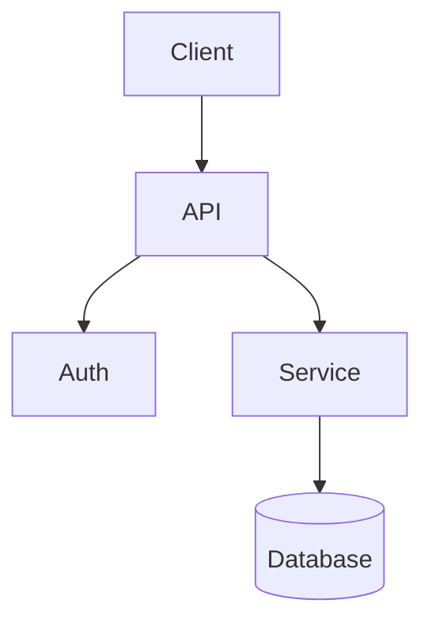
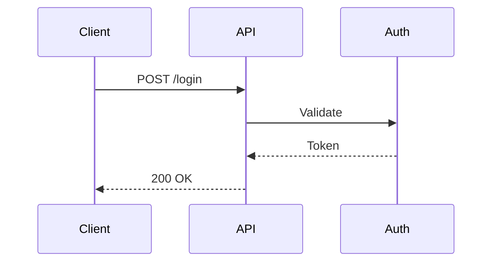

## Instructions

When user wants to create documentation:

### Step 0: Read Context

**Read `.devdoc/context.json` if it exists:**
- Use `product.name` for product references
- Apply `terminology.glossary` for correct terms
- Use `documentation.codeExamples.primaryLanguage` for code
- Read templates from `documentation.templates`

### Step 1: Understand What to Create

Ask the user:

"What would you like to document?

1. **A specific feature or concept** - I'll create a guide/tutorial
2. **Code files or functions** - Point me to the code, I'll generate docs
3. **API endpoints** - I'll analyze your API and create reference docs
4. **Something else** - Describe what you need"

### Step 2: Gather Information

Based on their choice:

#### For Feature/Concept:
- "What's the topic/title?"
- "What type of page?
  - Guide - Explains how to do something
  - Tutorial - Step-by-step walkthrough
  - Reference - Technical specifications
  - Troubleshooting - Problem/solution format"
- "Any specific sections you want included?"

#### For Code Documentation:
- "Which files or directories should I analyze?"
- "What should I focus on?
  - Public API/exports
  - Internal architecture
  - Usage examples
  - All of the above"
- Read the specified files
- Extract functions, classes, types, examples

#### For API Documentation:
- Check for existing OpenAPI/GraphQL specs
- If found: "I found `{spec}`. Should I generate docs from it?"
- If not: "Point me to your API routes/controllers"
- Extract endpoints, parameters, responses

#### For Other:
- Ask clarifying questions
- Understand the scope and purpose

### Step 3: Search Codebase (CRITICAL - No Hallucination)

**ALWAYS search and read actual files before generating content:**

#### 3a. Search for Relevant Files

```bash
# Find files related to the topic
git ls-files | grep -iE "(auth|login|session)"  # for auth docs

# Search file contents for specific terms
rg -l "export.*function.*createUser" --type ts
rg -l "class.*Authentication" --type ts

# Find types and interfaces
rg -l "interface.*User|type.*User" --type ts

# Find examples
git ls-files | grep -iE "(example|test|spec)"
```

#### 3b. Read the Files Found

For each relevant file:
1. **Read the file** - Get actual implementation
2. **Extract key info:**
   - Function signatures and parameters
   - Type definitions
   - Error codes and messages
   - Code examples from tests

#### 3c. Assess Information Sufficiency

```
┌─────────────────────────────────────────────┐
│ ASSESSMENT                                  │
├─────────────────────────────────────────────┤
│ ✅ Sufficient - Found source files          │
│    → Proceed with real data                 │
│                                             │
│ ⚠️ Partial - Some gaps                      │
│    → Generate with TODOs for gaps           │
│                                             │
│ ❌ Insufficient - No relevant files         │
│    → FLAG and offer options                 │
└─────────────────────────────────────────────┘
```

#### 3d. Handle Insufficient Information

**If files not found, present options:**

```
⚠️ UNCLEAR TOPIC: [topic]

Searched for:
  - src/**/*auth*.ts → Not found
  - lib/**/*auth*.ts → Not found

Options:
  1. 🔄 **Skip this doc** - Remove from plan
  2. ✏️  **Different topic** - Document something else
  3. 📝 **Mark as TODO** - Create placeholder
  4. ❓ **Ask for path** - "Where is [topic] implemented?"

Choose an option (1-4):
```

#### 3e. Detect Feature Flags & Duplicates

**Search for feature flags:**
```bash
# Find feature flag patterns
rg -l "featureFlag|feature_flag|isEnabled|FF_" --type ts
rg "if.*\(.*feature|process\.env\.FEATURE" --type ts
rg "LaunchDarkly|Unleash|Split|flagsmith" --type ts
```

**Search for duplicate/similar features:**
```bash
# Find similar function names
rg "export.*(login|authenticate|signIn)" --type ts -l
rg "export.*(createUser|addUser|registerUser)" --type ts -l
```

**Flag findings for user guidance:**
```
⚠️ FEATURE FLAGS DETECTED:

📍 src/lib/auth/index.ts:45
   if (featureFlags.newAuthFlow) { ... }
   
   This feature has TWO implementations:
   - OLD: lines 50-80 (current default)
   - NEW: lines 82-120 (behind feature flag)
   
   Question: Document which version?
   1. Current (old) implementation
   2. New implementation (feature flagged)
   3. Both with toggle notice

⚠️ DUPLICATE FEATURES DETECTED:

Found similar functions:
- src/lib/auth/login.ts → login()
- src/lib/auth/v2/authenticate.ts → authenticate()
- src/lib/legacy/signIn.ts → signIn()

Question: Which should be documented?
1. Document primary (login.ts)
2. Document all with comparison
3. Mark legacy as deprecated
```

#### 3f. Show What Was Found

```
📂 FILES FOUND for [topic]:

✓ src/lib/auth/index.ts (main auth module)
  - login(email, password): Promise<Token>
  - logout(): void
  - verifyToken(token): boolean

✓ src/lib/auth/types.ts
  - interface User { id, email, role }
  - type AuthToken { token, expiresAt }

✓ tests/auth.test.ts
  - Example usage patterns

⚠️ FEATURE FLAGS: newAuthFlow (src/lib/auth/index.ts:45)
⚠️ DUPLICATES: authenticate() in v2/, signIn() in legacy/

Proceed with generating documentation from these files?
```

### Step 4: Choose Template

Read the appropriate template from `.devdoc/templates/`:

| Content Type | Template |
|--------------|----------|
| How-to guide | `guide.md` |
| Tutorial | `tutorial.md` |
| API endpoint | `api-reference.md` |
| Quick start | `quickstart.md` |
| FAQ/Issues | `troubleshooting.md` |

### Step 5: Draft Content (From Real Files Only)

**CRITICAL: Only use data from files you actually read.**

Draft the documentation (DO NOT WRITE YET):

1. **Read the template** for structure guidance
2. **Apply context** (terminology, voice, language)
3. **Use ONLY data from searched files:**
   - Get exact function signatures from source files
   - Get type definitions from actual type files
   - Reference examples from test files or examples folder
   - Document errors from error handling code
4. **Include mermaid diagrams** for flows/architecture
5. **Add real code examples** copied from codebase
6. **Use proper MDX components** (Steps, Cards, Tabs, etc.)
7. **Cite sources** - Note which files info came from
8. **Mark feature flags** - Note conditional features
9. **Note duplicates** - Reference related/similar features

**NEVER generate content without reading source files first.**

### Step 6: Review Content with User (MANDATORY)

**ALWAYS show the complete draft for user review before writing:**

```
═══════════════════════════════════════════════════════════
                    CONTENT REVIEW
═══════════════════════════════════════════════════════════

📄 FILE: docs/guides/authentication.mdx

───────────────────────────────────────────────────────────
                    DRAFT CONTENT
───────────────────────────────────────────────────────────

---
title: Authentication
description: Learn how to authenticate users in your app
sources: ["src/lib/auth/index.ts", "src/lib/auth/types.ts"]
---

## Overview

Authentication allows users to securely access your application...

## login(email, password)

Authenticate user and return JWT token.

| Parameter | Type | Description |
|-----------|------|-------------|
| email | string | User email address |
| password | string | User password |

**Returns:** `Promise<AuthToken>`

### Example

```typescript
import { login } from '@package/auth';

const token = await login('user@example.com', 'password');
```

## Next Steps

...

───────────────────────────────────────────────────────────
                    NOTICES
───────────────────────────────────────────────────────────

⚠️ FEATURE FLAG: newAuthFlow
   This feature has a new implementation behind a flag.
   Currently documenting: OLD implementation
   
🔄 DUPLICATE: authenticate() exists in src/lib/auth/v2/
   Consider: Document both or mark one as preferred?

───────────────────────────────────────────────────────────
                    OPTIONS
───────────────────────────────────────────────────────────

1. ✅ **Approve** - Create file with this content
2. ✏️  **Edit** - Tell me what to change
3. 🔄 **Switch version** - Document feature-flagged version instead
4. ➕ **Add duplicate** - Include related feature documentation
5. ❌ **Cancel** - Don't create this file

Choose an option:
```

### Step 7: Propose File Location

After content approval, suggest where to save:

"I'll create this page at: `docs/guides/{topic}.mdx`

Does this location work, or would you prefer somewhere else?"

### Step 8: Create and Update Navigation

**Only after user approves content AND location:**

1. Write the MDX file
2. Ask: "Should I add this to the navigation in docs.json?"
3. If yes, update docs.json with the new page

### Step 9: Summary

"Created:
- `docs/guides/{topic}.mdx` - {description}
- Updated `docs.json` navigation

Preview with `npm run dev`

Want me to create another page or make changes to this one?"

---

## Code Documentation Examples

### From TypeScript/JavaScript:

```typescript
// Source: src/utils/auth.ts
export function validateToken(token: string): boolean {
  // ... implementation
}
```

Generates:

```mdx
## validateToken

Validates an authentication token.

### Parameters

| Parameter | Type | Description |
|-----------|------|-------------|
| `token` | `string` | The JWT token to validate |

### Returns

`boolean` - `true` if valid, `false` otherwise

### Example

```typescript
import { validateToken } from '@package/auth';

const isValid = validateToken(userToken);
if (!isValid) {
  throw new Error('Invalid token');
}
```
```

### From Python:

```python
# Source: src/auth.py
def validate_token(token: str) -> bool:
    """
    Validate an authentication token.
    
    Args:
        token: The JWT token to validate
        
    Returns:
        True if valid, False otherwise
    """
```

Generates similar documentation following the template structure.

---

## Key Principles

| Principle | Description |
|-----------|-------------|
| **Search before generate** | ALWAYS search/read files before writing |
| **No hallucination** | Only use data from actual source files |
| **Review before write** | ALWAYS show draft to user for approval |
| **Flag feature flags** | Detect and highlight conditional features |
| **Flag duplicates** | Identify similar/related features |
| **Use mermaid diagrams** | Visualize architecture, flows, sequences |
| **Cite sources** | Note which files information came from |

## Quality Guidelines

- **SEARCH FIRST** - Never generate without reading source files
- **REVIEW WITH USER** - Always show draft before creating file
- **DETECT FEATURE FLAGS** - Search for conditional features
- **DETECT DUPLICATES** - Find similar functions/features
- Extract real code examples from actual files
- Flag insufficient info and offer auto-correct options
- Include error handling from source code
- Add TODO markers for sections needing human review
- Link to related documentation
- Apply terminology from context.json
- Cite source files in frontmatter

## Mermaid Diagram Requirements

**ALWAYS include mermaid diagrams for:**

| Content Type | Diagram | Example |
|--------------|---------|---------|
| Architecture | `flowchart TB` | System components |
| Data flow | `flowchart LR` | Request processing |
| API calls | `sequenceDiagram` | Auth flow |
| State machine | `stateDiagram-v2` | Lifecycle |
| Data models | `erDiagram` | Database schema |

**Example for architecture docs:**


**Example for API docs:**

