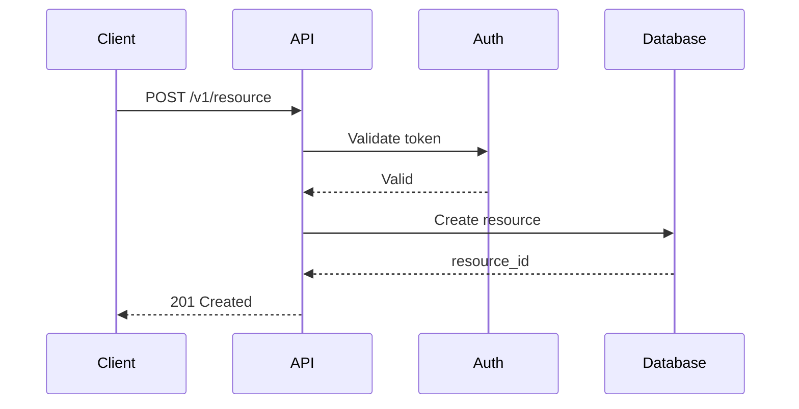
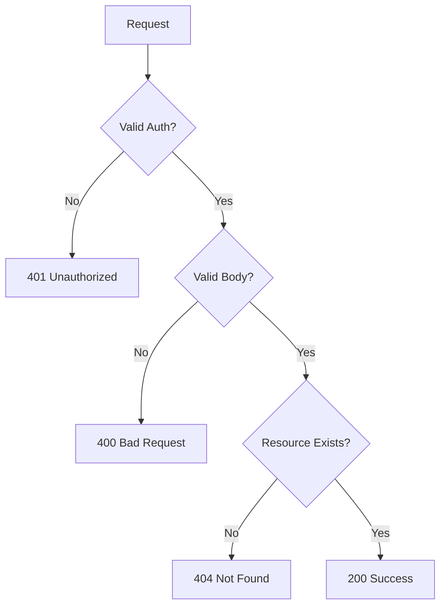
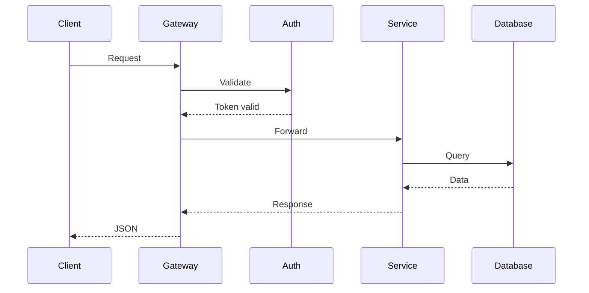
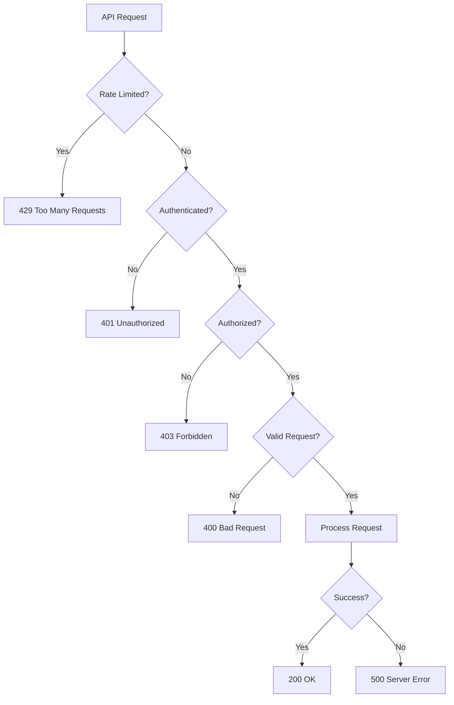
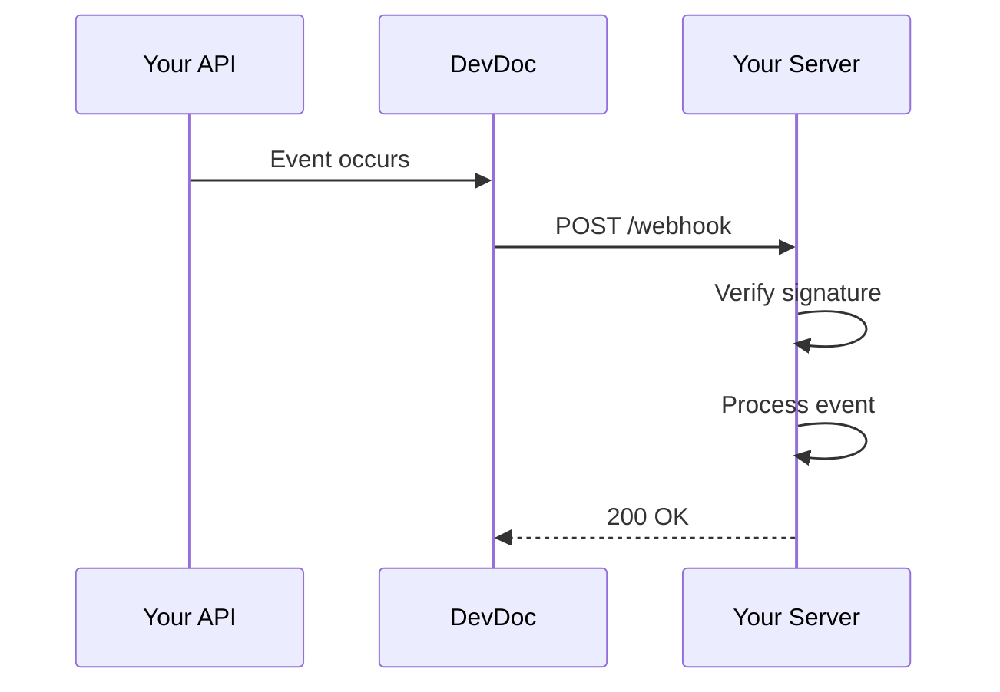
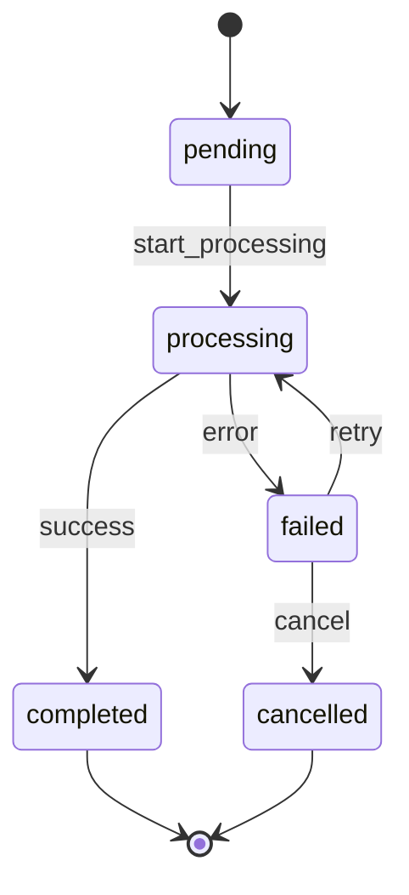

# API Reference Template

Use this structure when creating API endpoint documentation.

## Format

```mdx
---
title: [HTTP Method] [Endpoint Name]
description: [Brief description of what this endpoint does]
---

## Endpoint

<ParamField method="POST" path="/v1/resource">
  Brief description of the endpoint's purpose.
</ParamField>

## Request Flow

Visualize the API flow with a sequence diagram:



## Authentication

<Note>
This endpoint requires [authentication type]. Include your API key in the `Authorization` header.
</Note>

## Request

### Headers

| Header | Required | Description |
|--------|----------|-------------|
| `Authorization` | Yes | Bearer token or API key |
| `Content-Type` | Yes | `application/json` |

### Path Parameters

<ParamField path="id" type="string" required>
  The unique identifier of the resource.
</ParamField>

### Query Parameters

<ParamField query="limit" type="integer" default="20">
  Maximum number of results to return.
</ParamField>

### Request Body

<ParamField body="name" type="string" required>
  The name of the resource.
</ParamField>

<ParamField body="metadata" type="object">
  Optional metadata object.
</ParamField>

## Response

### Success Response (200)

```json
{
  "id": "res_123",
  "name": "Example",
  "created_at": "2026-01-24T10:00:00Z"
}
```

### Error Responses

| Status | Code | Description |
|--------|------|-------------|
| 400 | `invalid_request` | Request validation failed |
| 401 | `unauthorized` | Invalid or missing API key |
| 404 | `not_found` | Resource not found |

## Error Flow



## Code Examples

<CodeGroup>
```bash cURL
curl -X POST https://api.example.com/v1/resource \
  -H "Authorization: Bearer YOUR_API_KEY" \
  -H "Content-Type: application/json" \
  -d '{"name": "Example"}'
```

```typescript TypeScript
const response = await client.resource.create({
  name: "Example"
});
```

```python Python
response = client.resource.create(
    name="Example"
)
```
</CodeGroup>
```

## Mermaid Diagram Guidelines

### Sequence Diagrams for API Flows

Show the complete request lifecycle:



### Error Handling Flow



### Webhook Flow



### State Transitions



## Guidelines

- Always show request and response examples
- Include all possible error codes
- Provide examples in multiple languages
- Document rate limits if applicable
- **Use sequence diagrams** for complex flows
- **Use flowcharts** for error handling logic
- **Use state diagrams** for resource lifecycles
