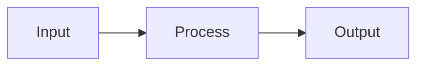
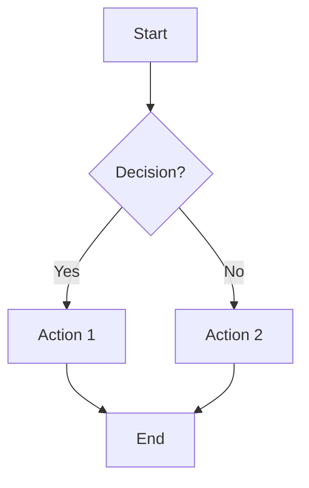
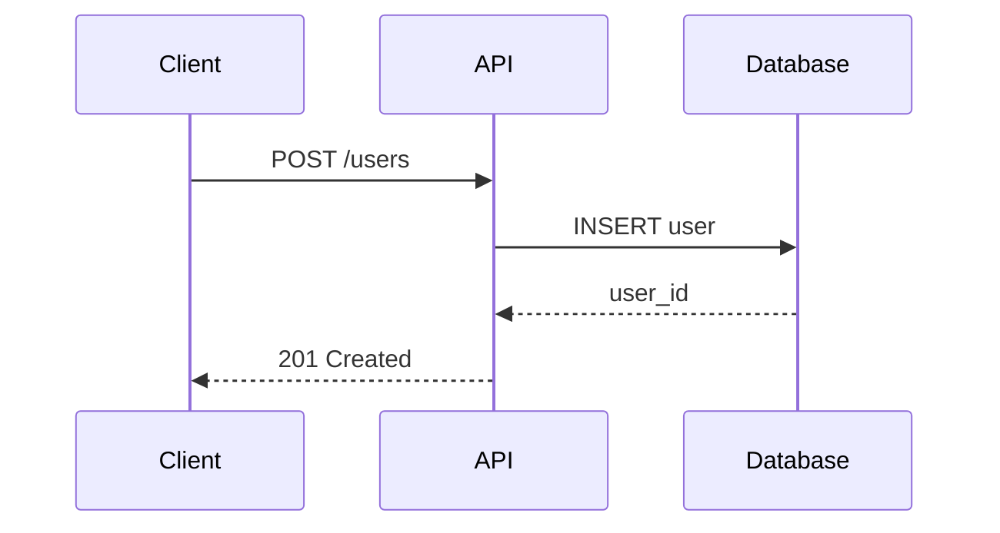
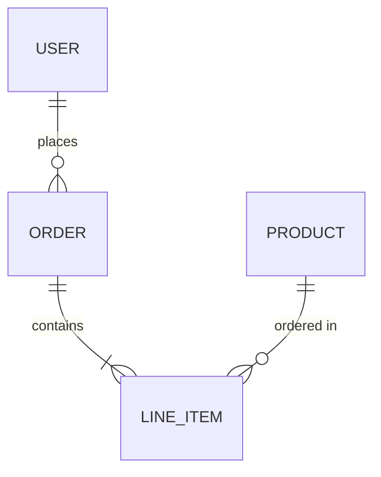
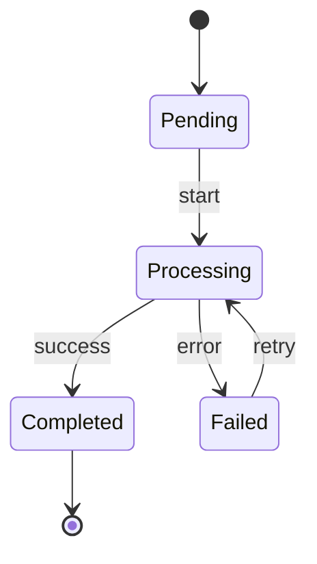

# Guide Template

Use this structure when creating guide documentation.

## Format

```mdx
---
title: [Action] + [Topic]
description: Learn how to [achieve specific outcome]
---

## Overview

Brief introduction (2-3 sentences):
- What this guide covers
- Who it's for
- What you'll achieve

## Prerequisites

<Note>
Before you begin, ensure you have:
- [Requirement 1]
- [Requirement 2]
</Note>

## Architecture / Flow (if applicable)

Use mermaid diagrams to visualize:



## Steps

<Steps>
  <Step title="Step name">
    Explanation of what this step does.
    
    ```language
    // Code example
    ```
  </Step>
  
  <Step title="Next step">
    Continue with clear, actionable steps.
  </Step>
</Steps>

## Example

Complete working example showing the end result.

```language
// Full example code
```

## Next Steps

<CardGroup cols={2}>
  <Card title="Related Guide" href="/path">
    Brief description
  </Card>
</CardGroup>
```

## Mermaid Diagram Guidelines

### When to Use Diagrams

- **Flowcharts**: For processes, decision trees, workflows
- **Sequence diagrams**: For API calls, request/response flows
- **Entity diagrams**: For data models, relationships
- **State diagrams**: For state machines, status transitions

### Flowchart Example



### Sequence Diagram Example



### Entity Relationship Example



### State Diagram Example



## Guidelines

- Start with the outcome, not the process
- Each step should be independently verifiable
- Include error handling in code examples
- Link to related guides at the end
- **Use mermaid diagrams** to visualize complex flows
- Keep diagrams simple - max 7-10 nodes
