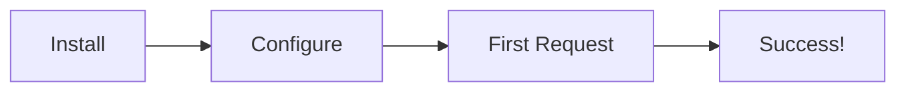
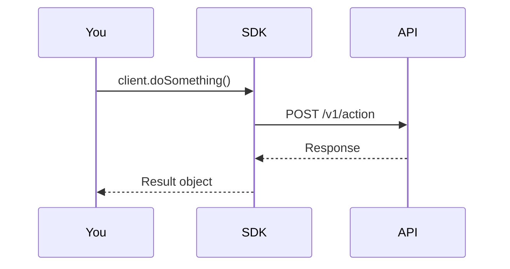
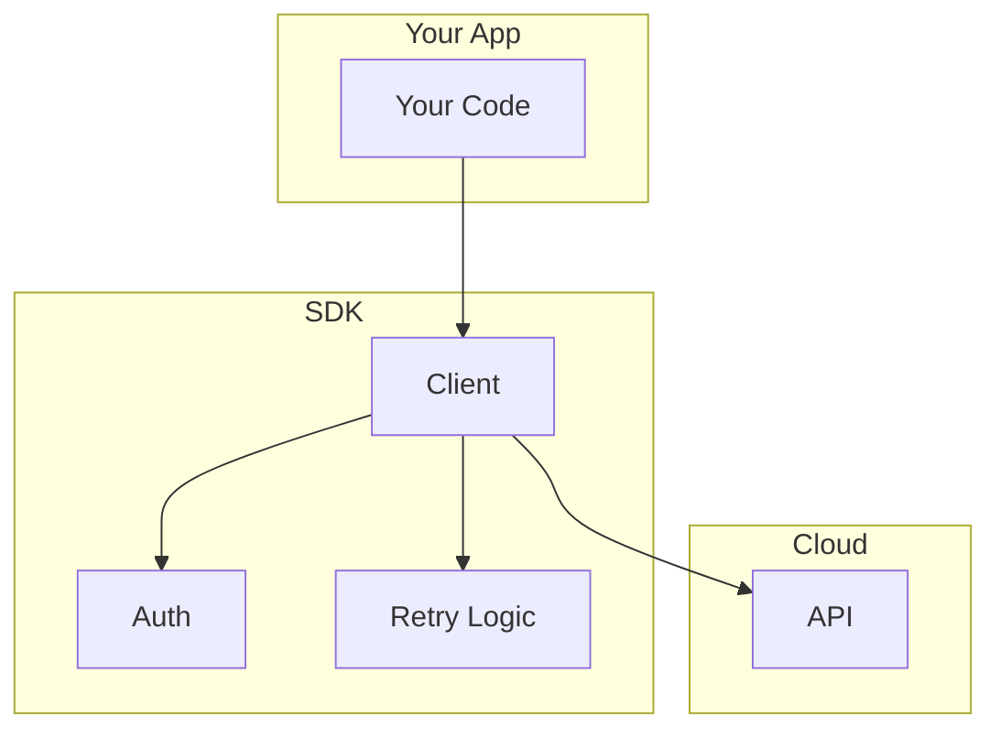
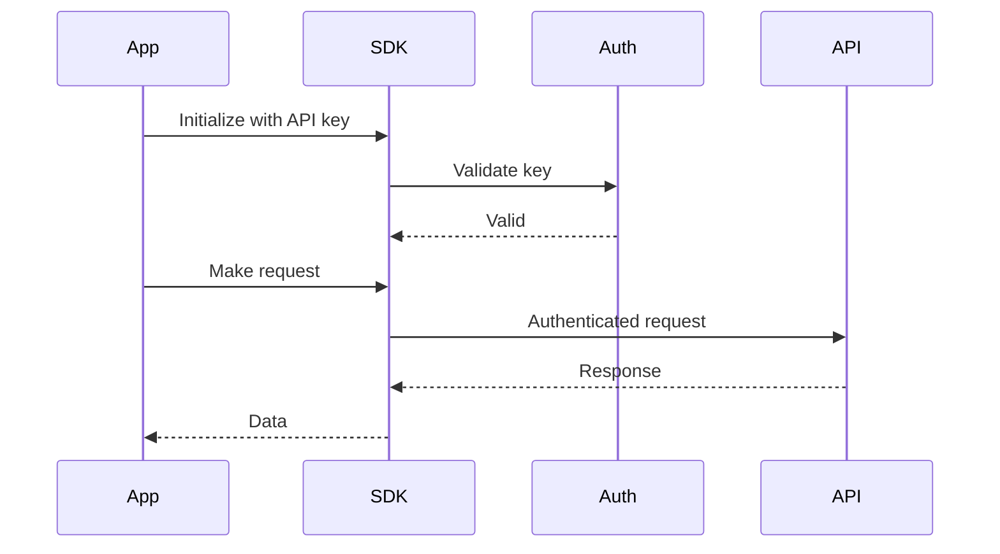

# Quickstart Template

Use this structure for getting-started documentation.

## Format

```mdx
---
title: Quickstart
description: Get up and running with [Product] in 5 minutes
---

## Overview

[Product] helps you [main value proposition]. This guide gets you from zero to [first success metric] in under 5 minutes.

## How It Works



## 1. Install

<CodeGroup>
```bash npm
npm install package-name
```

```bash yarn
yarn add package-name
```

```bash pnpm
pnpm add package-name
```
</CodeGroup>

## 2. Configure

Create a configuration file or set environment variables:

```bash
export API_KEY=your_api_key_here
```

Or create a config file:

```json
{
  "apiKey": "your_api_key_here"
}
```

<Note>
Get your API key from the [dashboard](https://example.com/dashboard).
</Note>

## 3. First Request

Make your first API call:

```typescript
import { Client } from 'package-name';

const client = new Client({ apiKey: process.env.API_KEY });

const result = await client.doSomething({
  input: "Hello, world!"
});

console.log(result);
```

Expected output:

```json
{
  "success": true,
  "data": "..."
}
```

## What Happens Behind the Scenes



## Next Steps

<CardGroup cols={2}>
  <Card title="Core Concepts" icon="book" href="/concepts">
    Understand how [Product] works.
  </Card>
  <Card title="API Reference" icon="code" href="/api-reference">
    Explore all available endpoints.
  </Card>
  <Card title="Examples" icon="folder" href="/examples">
    See real-world use cases.
  </Card>
  <Card title="SDKs" icon="puzzle" href="/sdks">
    Official client libraries.
  </Card>
</CardGroup>
```

## Mermaid Diagram Guidelines

### Simple Flow for Quickstart

Keep it simple - show the journey:

```mermaid
flowchart LR
    A["📦 Install"] --> B["⚙️ Configure"]
    B --> C["🚀 Use"]
    C --> D["✅ Done!"]
```



### SDK Architecture



### Authentication Flow



## Guidelines

- Keep it under 5 minutes to complete
- Use the minimum viable example
- Show expected output at each step
- Link to deeper documentation at the end
- Include multiple installation methods
- **Use simple flowcharts** to show the process
- **Use sequence diagrams** to explain what happens
