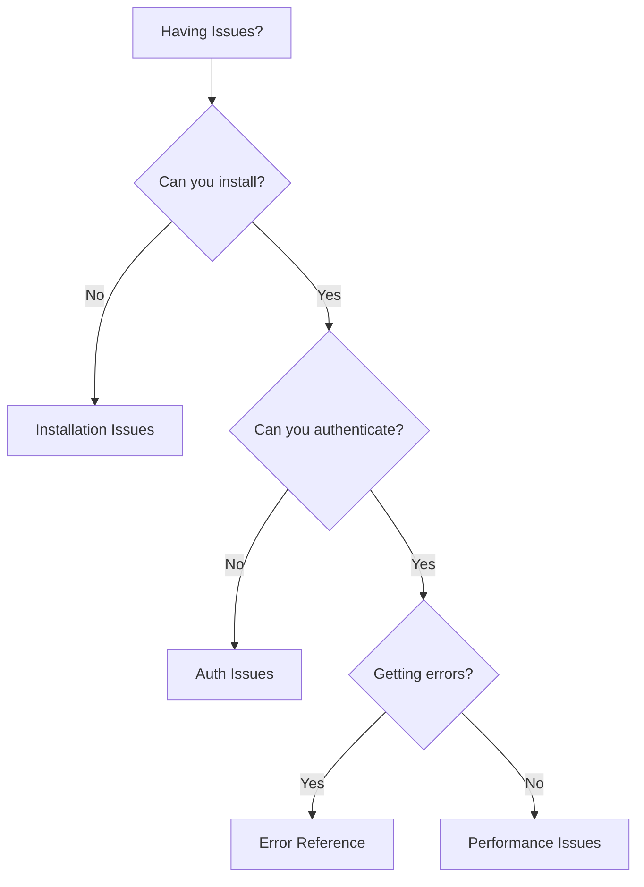
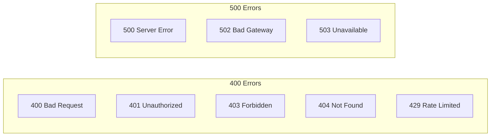
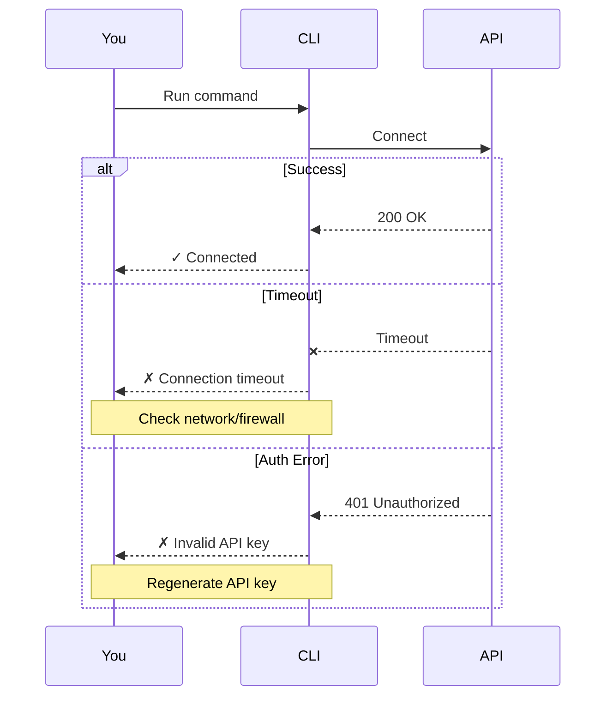
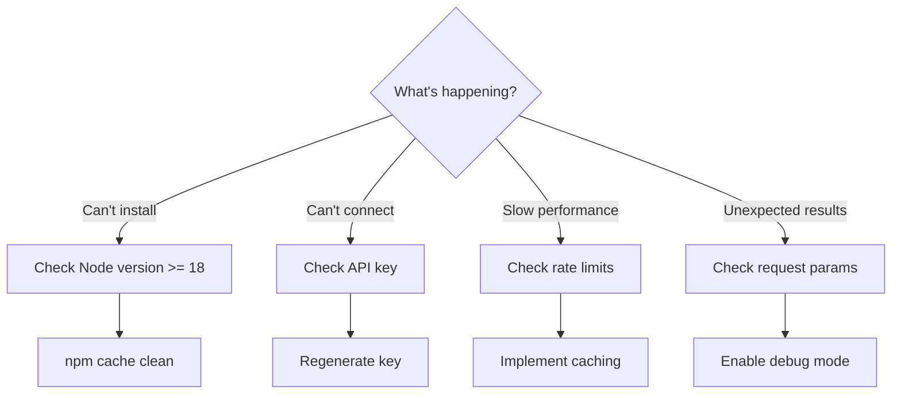
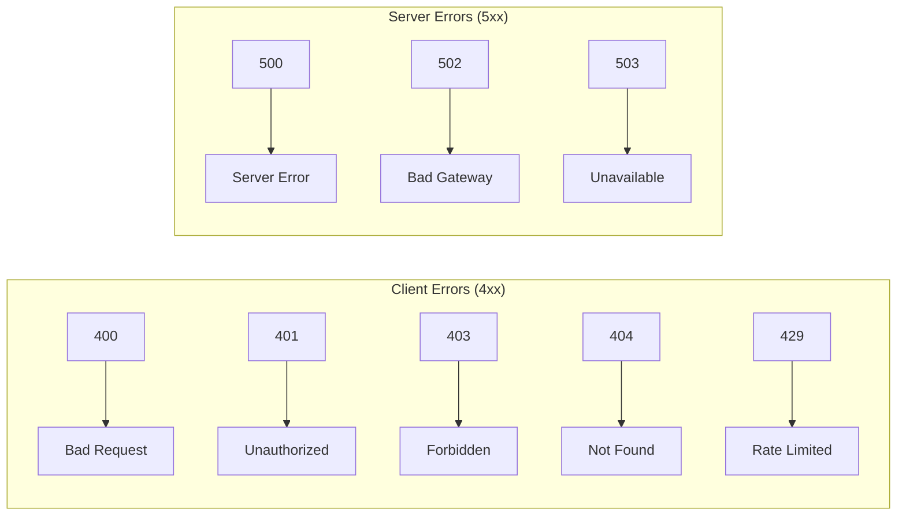
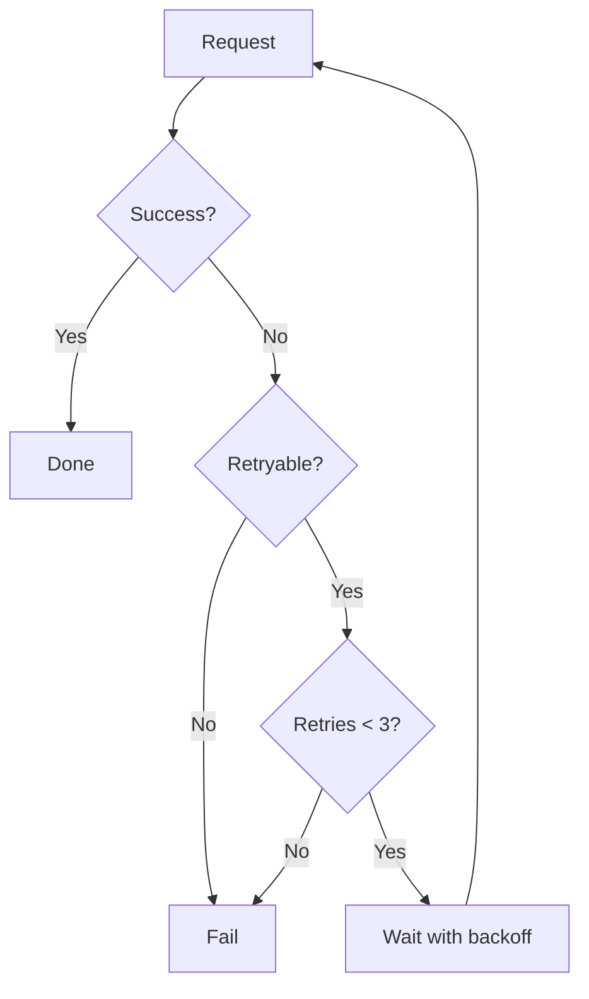

# Troubleshooting Template

Use this structure for troubleshooting and FAQ documentation.

## Format

```mdx
---
title: Troubleshooting [Topic]
description: Solutions for common [Topic] issues
---

## Decision Tree

Use this to find your issue:



## Common Issues

### Error: [Exact error message]

<Accordion title="[Short description of the error]">
**Symptoms:**
- What the user sees
- When it typically occurs

**Cause:**
Brief explanation of why this happens.

**Solution:**

<Steps>
  <Step title="Check [first thing]">
    ```bash
    command to diagnose
    ```
  </Step>
  <Step title="Fix [the issue]">
    ```bash
    command to fix
    ```
  </Step>
</Steps>

**Prevention:**
How to avoid this in the future.
</Accordion>

### [Another common issue]

<Accordion title="[Description]">
**Symptoms:**
- Symptom 1
- Symptom 2

**Cause:**
Explanation.

**Solution:**
Step-by-step fix.
</Accordion>

## Error Flow Reference



## Diagnostic Commands

Useful commands for debugging:

```bash
# Check version
package-name --version

# Verify configuration
package-name config validate

# Test connection
package-name ping

# Debug mode
DEBUG=* package-name command
```

## Connection Troubleshooting



## Getting Help

If you're still experiencing issues:

1. **Search existing issues:** [GitHub Issues](https://github.com/org/repo/issues)
2. **Community support:** [Discord](https://discord.gg/example)
3. **Contact support:** [support@example.com](mailto:support@example.com)

When reporting an issue, include:
- Error message (full stack trace)
- Package version (`package-name --version`)
- Environment (OS, Node version, etc.)
- Steps to reproduce
```

## Mermaid Diagram Guidelines

### Decision Trees

Help users find their issue:



### Error Code Reference



### Retry Logic



## Guidelines

- Use exact error messages as headings (searchable)
- Provide copy-paste solutions
- Include diagnostic commands
- Explain the "why" not just the "how"
- Link to support channels
- **Use decision trees** to guide users to solutions
- **Use sequence diagrams** for debugging flows
- **Use flowcharts** for retry/error handling logic
