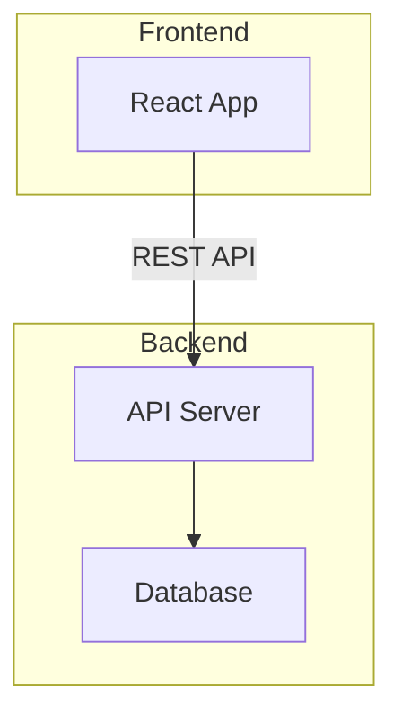
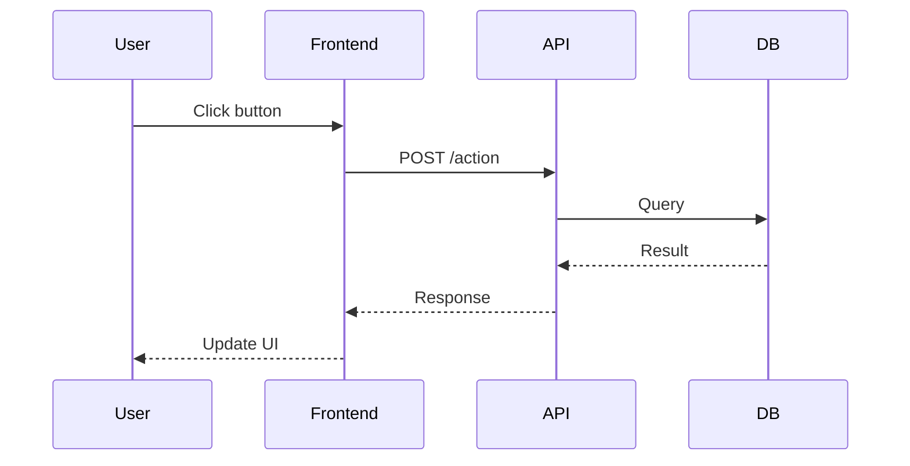
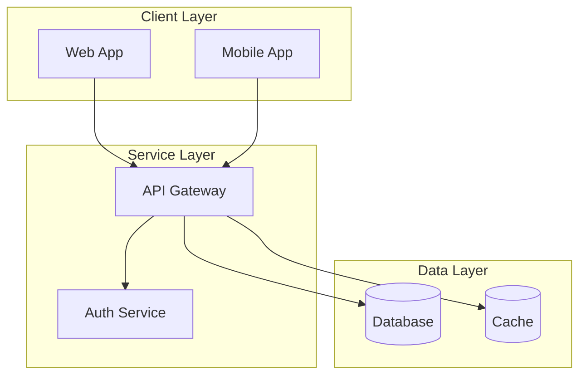
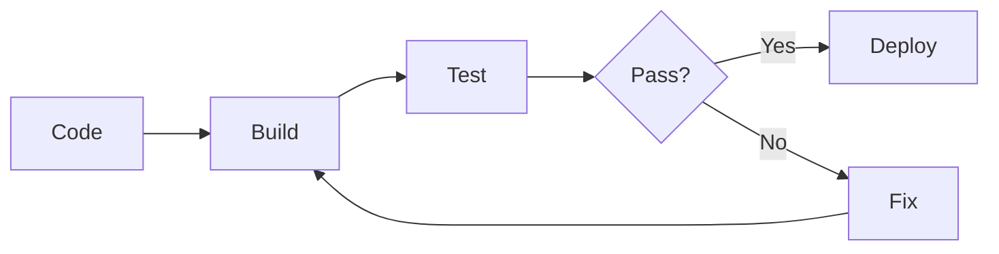
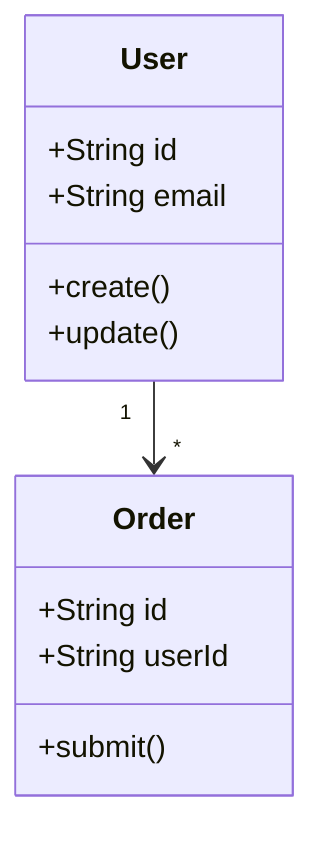

# Tutorial Template

Use this structure when creating step-by-step tutorials.

## Format

```mdx
---
title: Build [Something] with [Technology]
description: A complete tutorial to [achieve outcome] from scratch
---

## What You'll Build

[Screenshot or diagram of the final result]

Brief description of the end result and why it's useful.

**Time to complete:** ~X minutes

## Architecture Overview

Show the system architecture with a mermaid diagram:



## Prerequisites

- [Prerequisite 1 with link]
- [Prerequisite 2 with link]
- Basic knowledge of [topic]

## Project Setup

<Steps>
  <Step title="Create a new project">
    ```bash
    mkdir my-project && cd my-project
    npm init -y
    ```
  </Step>
  
  <Step title="Install dependencies">
    ```bash
    npm install package-name
    ```
  </Step>
</Steps>

## Part 1: [First Major Section]

### Step 1.1: [Specific Task]

Explanation of what we're doing and why.

```language
// Code with comments explaining key parts
```

<Tip>
Pro tip or best practice related to this step.
</Tip>

### Step 1.2: [Next Task]

Continue building on the previous step.

## Part 2: [Second Major Section]

### Data Flow

Visualize the data flow:



### Step 2.1: [Task]

Break complex tutorials into logical parts.

## Testing Your Implementation

How to verify everything works:

```bash
npm test
# or
npm run dev
```

Expected output:
```
✓ All tests passed
```

## Troubleshooting

<Accordion title="Error: [Common error message]">
  **Cause:** Explanation of why this happens.
  
  **Solution:** How to fix it.
</Accordion>

## Next Steps

Now that you've built [X], you can:

- [Enhancement 1]
- [Enhancement 2]
- [Related tutorial link]

## Complete Code

<Accordion title="View complete source code">
```language
// Full working code
```
</Accordion>
```

## Mermaid Diagram Guidelines

### Architecture Diagrams

Use subgraphs to group related components:



### Process Flow

Show the build/deploy process:



### Class/Component Diagram



## Guidelines

- Show the end result first to motivate readers
- Break into digestible parts (10-15 min each)
- Include checkpoints where readers can verify progress
- Provide complete code at the end for reference
- Add troubleshooting for common issues
- **Use architecture diagrams** at the start
- **Use sequence diagrams** for API interactions
- **Use flowcharts** for decision logic
